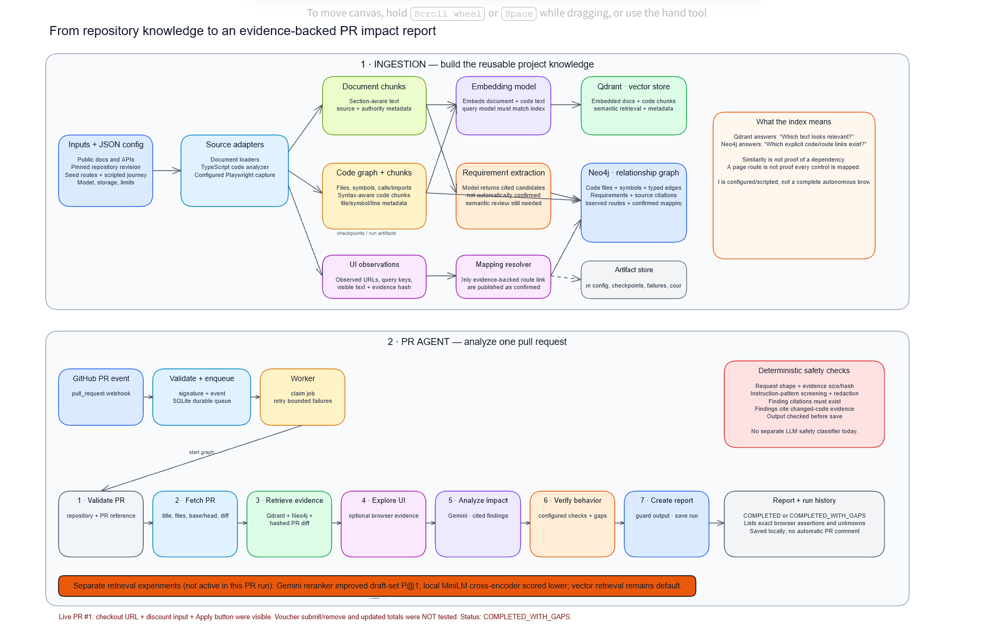
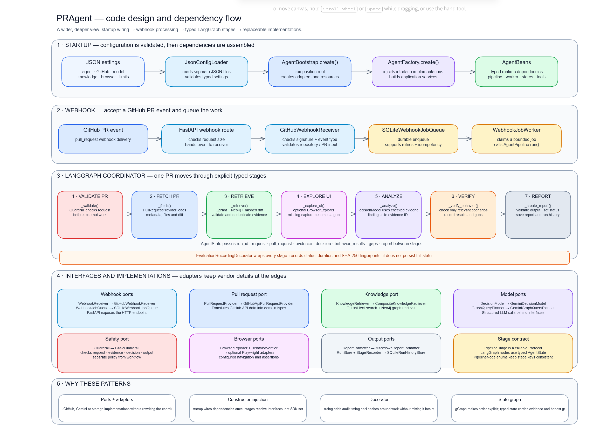
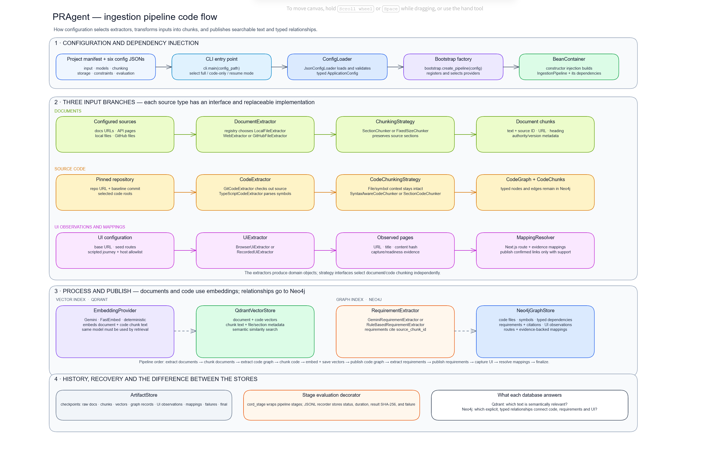

# PRAgent

PRAgent is a local, webhook-driven pull-request impact analyzer. A separate ingestion pipeline builds project knowledge in Qdrant and Neo4j; the agent uses that knowledge, the pull-request diff, and optional browser checks to write an evidence-linked report on the PR.

## At a glance

The project has two independently runnable parts: **ingestion** builds reusable code and product knowledge; **the agent** uses that knowledge to analyze one pull request.



The code-level views show how startup, interfaces, dependency injection, LangGraph stages, and storage fit together:





Editable source diagrams are in [`docs/project`](docs/project/): `architecture-flow.excalidraw`, `code-design.excalidraw`, and `ingestion-code-flow.excalidraw`.

## Requirements

- Python 3.11–3.14 and [`uv`](https://docs.astral.sh/uv/)
- Git access to the source repository being indexed and reviewed
- Gemini API key, Neo4j credentials, and a GitHub token with permission to read PRs and write issue comments
- A public HTTPS tunnel such as ngrok or Cloudflare Tunnel to deliver GitHub webhooks to a local server

Never commit `.env` files or credentials. Each component has an `.env.example` with the expected variable names.

## Run the ingestion pipeline (first setup or refresh)

From the project root, in PowerShell:

```powershell
cd ingestion
uv sync --group dev
Copy-Item .env.example .env   # only the first time
# Edit .env with Gemini and Neo4j credentials; Qdrant uses local storage by default.
uv run playwright install chromium
```

The Saleor manifest expects its source checkout at `ingestion/work/saleor-storefront-upstream` (or update `configs/saleor/input.json` to your checkout). To refresh the code graph and browser-observed routes without embedding documents:

```powershell
uv run ingest configs/saleor.json --code-ui-only
```

For a complete document, code, embedding, and storage run, use `uv run ingest configs/saleor.json`. This calls the configured Gemini models and writes to Qdrant and Neo4j, so it may use API quota. For options and recovery modes, see [the ingestion README](ingestion/README.md).

## Run the live PR agent

Open a second PowerShell terminal from the project root:

```powershell
cd agents
uv sync --extra dev
Copy-Item .env.example .env   # only the first time
# Edit .env: set GITHUB_TOKEN, GITHUB_WEBHOOK_SECRET, GEMINI_API_KEY,
# NEO4J_URI, NEO4J_USERNAME, NEO4J_PASSWORD, and NEO4J_DATABASE.
uv run playwright install chromium
uv run python run_local.py
```

The API and queue worker run together on `http://127.0.0.1:8000`. Check it with:

```powershell
Invoke-WebRequest http://127.0.0.1:8000/health
```

In another terminal, expose port 8000 with your tunnel tool, for example `ngrok http 8000`. In the target GitHub repository’s **Settings → Webhooks**, add the tunnel URL ending in `/webhooks/github`, choose `application/json`, use the same secret as `GITHUB_WEBHOOK_SECRET`, and subscribe to **Pull requests**. The configured receiver accepts `opened`, `synchronize`, and `reopened` actions. Open a fresh test PR to see the agent process it and post a report comment. Keep both the server and tunnel running during the demo; stop them with `Ctrl+C` when finished.

Agent reports and run history are stored locally in `agents/data/agent-runs.sqlite3`; webhook jobs are stored in `agents/data/webhook-jobs.sqlite3`. See [the agent README](agents/README.md) for configuration, behavior-check scope, and troubleshooting.

## Run tests

From the project root, run each component’s tests in its own environment:

```powershell
cd agents
uv sync --extra dev
uv run ruff check .
uv run mypy src
uv run pytest -q

cd ..\ingestion
uv sync --group dev
uv run ruff check .
uv run mypy src
uv run pytest -q
```

These automated tests primarily mock GitHub, Gemini, Qdrant, Neo4j, and browser services. A passing suite is not a substitute for a live webhook run.

## Evaluation and current limits

- The agent report-quality judge is run from `agents/`; see [its evaluation guide](agents/evaluation/agent_quality/README.md).
- Code-graph retrieval precision/recall and its separate Gemini relevance judge are described in [the code-retrieval evaluation guide](agents/evaluation/code_retrieval/README.md).
- The ingestion retrieval dataset and its review status are documented in [the ingestion evaluation guide](ingestion/evaluation/README.md) and [dataset README](ingestion/evaluation/datasets/saleor-retrieval-v0.1/README.md).

The current Saleor behavior checks are scripted smoke checks, not autonomous UI exploration. A passing assertion confirms only that assertion; for example, seeing a voucher field does not verify applying or removing a voucher. Some changed files still lack confirmed code-to-UI mappings, and evaluation labels remain drafts pending independent human review. Reports surface these limits as coverage gaps.

## Project design documents

- [Architecture flow](docs/project/architecture-flow.excalidraw)
- [Agent code design](docs/project/code-design.excalidraw)
- [Ingestion pipeline flow](docs/project/ingestion-code-flow.excalidraw)
- [Design document](docs/project/design-document.md)
- [Presentation and interview guide](docs/project/presentation-and-interview-guide.md)
- [Sample PR impact report](docs/project/sample-pr-impact-report.md)
