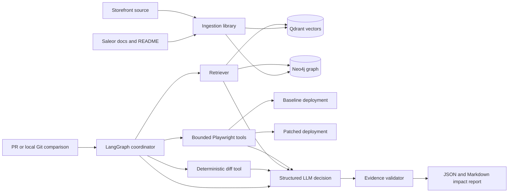
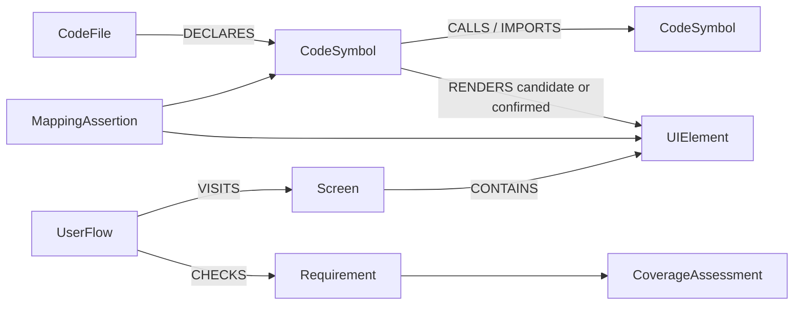

# Trace Impact: design document

**Candidate system:** Saleor storefront PR impact analysis
**Reference pull request:** Saleor Storefront PR 1199
**Narrow slice:** checkout voucher application and removal
**Status:** working prototype with live deployments, persisted knowledge, bounded agent execution, and saved evaluation evidence

## 1. Problem and chosen scope

The assignment asks for an agent that connects product intent, a running application, and source code, then explains which product behavior is at risk when code changes. I chose Saleor's public Next.js storefront because it has public source, public developer documentation, a real checkout domain, and enough behavior to demonstrate a three-layer graph without inventing a toy application.

The implemented slice follows voucher behavior from product documentation to checkout UI to the code changed by Saleor Storefront PR 1199. Two pinned storefront deployments share one Saleor backend: a baseline build and a patched build. The system ingests selected Saleor documentation, analyzes the TypeScript repository, captures browser states and transitions, stores searchable document evidence in Qdrant, stores explicit relationships in Neo4j, and runs a LangGraph coordinator that turns a PR diff into a bounded evidence-gathering plan and a QA-readable report.

The depth decision is deliberate. Voucher application and removal are tested end to end. Invalid vouchers, quantity changes while a voucher is active, and shipping prerequisites have separate backend behavior oracles. General checkout coverage, arbitrary repository support, authenticated customer flows, payment submission, and organization-scale deployment are outside the demonstrated slice.

## 2. Working-system overview



The repository contains two packages with a strict dependency direction. `trace-impact` is a reusable ingestion, retrieval, and evaluation library. `trace-coordinator` owns the PR workflow and depends on the library only through an adapter. The library does not depend on the coordinator. This permits a future split into separate services without rewriting the agent stages.

The running system uses these concrete inputs:

- nine explicitly configured Saleor documentation sources;
- 121 source-grounded chunks indexed in the vector store;
- a TypeScript code snapshot pinned to immutable revisions;
- Neo4j nodes and relationships scoped by project and snapshot;
- baseline and patched storefront URLs with runtime revision attestations;
- a sandbox voucher and fresh guest checkout fixtures;
- a real historical PR diff replayed from the local Git checkout.

Every editable configuration is JSON validated by a generated schema. Credentials are referenced by environment-variable name and never placed in a committed configuration or report.

## 3. Agent decomposition

The coordinator is a fixed outer workflow with limited agent decisions inside it. LangGraph supplies checkpoints, routing, interruption, and recovery. The LLM does not decide which repository, database, origin, or credential it may access.

| Stage | Responsibility | Deterministic or LLM-driven |
| --- | --- | --- |
| Validate | Parse schemas, resolve paths, check allowlists and budgets | Deterministic |
| Resolve change | Read the complete diff and pin base/head revisions | Deterministic Git adapter |
| Retrieve | Search vector evidence and traverse known graph paths | Deterministic queries and ranking |
| Explore | Select a useful action from observed controls | Structured LLM decision inside an allowlisted loop |
| Plan impact | Propose UI, flow, and requirement risks from supplied evidence | Structured LLM output |
| Validate claims | Reject unknown evidence IDs, missing citations, unsafe text, or unsupported certainty | Deterministic |
| Verify behavior | Execute approved browser and backend checks on fresh fixtures | Deterministic tools and assertions |
| Report | Render validated findings, checks, limits, and call usage | Deterministic template |

The agent receives compact evidence records rather than raw database clients or unrestricted browser objects. It can request only registered tools. Each `(run, agent, tool)` pair has a hard maximum of five attempts; failures and retries consume the same budget. Total calls, rounds, runtime, model repairs, and review requests also have independent caps. A sixth tool attempt is rejected before dispatch.

The model is called once for the main impact decision in the demonstrated run. It receives the diff summary, graph evidence, retrieved documents, UI observations, and explicit output schema. Invalid JSON gets one bounded repair attempt. Evidence IDs are validated against the run's evidence store. Text from PRs, documentation, and pages is treated as untrusted evidence and cannot change policies or tool permissions.

## 4. Ingestion as a library

Ingestion is split into replaceable contracts:

1. **Loaders** acquire configured inputs such as local files, URLs, or repository files.
2. **Parsers** convert each input into normalized documents with provenance.
3. **Chunkers** create retrieval units while preserving source and section identity.
4. **Requirement extractors** emit source-quoted candidates with checkpoints and bounded retries.
5. **Embedding providers** convert document chunks to vectors.
6. **Code analyzers** create files, symbols, imports, calls, and render candidates.
7. **Publishers** write vectors, graph records, and immutable run manifests.

Provider selection happens in JSON. Adding a loader or parser requires implementing its small interface and registering its option schema; orchestration code does not change. This is intentionally less generic than a visual pipeline builder: configuration selects implemented capabilities but cannot invent a new stage.

The active Saleor ingestion completed 121 of 121 chunks. Qdrant persistence was verified against source hashes and the cache. Neo4j publication was checked separately. Requirement extraction records source quotes and model provenance. A quote-grounded candidate is not automatically called a semantically approved requirement; independent review remains visible as a gap.

## 5. Retrieval design

The default path is vector retrieval without reranking. This keeps latency and cost low for the demonstrated corpus. The pipeline remains composable:

```text
Retriever -> optional Reranker -> EvidenceSelector
```

The retriever embeds the question and returns document chunks from the configured collection. The optional reranker can be a local cross-encoder or a separately configured LLM with its own model and API-key variable. The evidence selector removes redundant and weak passages and enforces the evidence budget. Neo4j retrieval runs scoped, parameterized traversals from changed files or symbols to mapped UI elements, user flows, and requirements. The LLM never writes Cypher.

Vector and graph retrieval answer different questions. Vectors find semantically related product language. The graph explains explicit dependency paths. A final finding may use either, but it must describe the evidence type. Similar text alone cannot create a confirmed code-to-UI relationship.

The saved 40-query vector benchmark measured passage recall@5 of 0.932, required-evidence recall@5 of 1.0, and mean reciprocal rank of 0.895. Raw precision@5 is low because multiple chunks can be relevant but only a smaller required-evidence set is labelled. The optional selector improved measured precision on the development set. These labels were produced during implementation and are not represented as independently reviewed product truth.

## 6. Graph schema and query justification

The graph uses stable project and snapshot scopes so baseline and head evidence never mix accidentally.



Core node types are `CodeFile`, `CodeSymbol`, `UIElement`, `Screen`, `UserFlow`, `Requirement`, `MappingAssertion`, and `CoverageAssessment`. Code relationships come from static analysis. Screens, elements, and transitions come from captured browser observations. Requirement records retain source identity and quote provenance. Mapping assertions keep method, status, evidence, revision, and alternatives.

The main blast-radius query starts at changed files or symbols and asks for reachable UI elements, flows containing those elements, and requirements checked by those flows. It returns only records in the selected project and committed snapshot. The query is implemented as parameterized application code. A missing path returns an explicit unmapped result rather than a guessed relationship.

The schema separates **candidate** mappings from **confirmed** mappings. A matching UI label in a diff and observed page can propose a structural connection. Runtime attribution or review is required before the system calls it confirmed. This prevents the graph from laundering similarity into fact.

## 7. Modeling absence

Absence is a record, not the lack of an edge. Every in-scope requirement can receive a `CoverageAssessment` with one of these statuses:

- `OBSERVED_TESTABLE`: captured UI and an observable check support the requirement;
- `NOT_OBSERVED_IN_SCOPE`: the planned scope was explored and no supporting UI was found;
- `BLOCKED`: authentication, prerequisites, or environment failure prevented inspection;
- `NOT_EXPLORED`: the budget or selected stage did not cover it;
- `AMBIGUOUS`: competing interpretations or mappings remain.

Each assessment records the requirement, crawl and revision, explored routes, attempts, reason, and evidence. This matters because a missing graph edge can mean at least four different things: the feature is absent, the crawler did not reach it, the mapper failed, or the current scope intentionally excluded it. Treating all four as “not affected” would create unsafe false negatives.

For the voucher slice, the baseline page contains a discount input and Apply button, yet the eligible voucher did not reach the backend and the displayed total did not change. This is not modeled as absent UI. It is an observed behavioral gap. The patched build demonstrates the apply and remove behavior, while untested order submission remains `NOT_EXPLORED` by policy.

## 8. Confidence and ambiguity

The system keeps four concepts separate:

1. **Retrieval score**: how similar a passage is to a question.
2. **Mapping status**: candidate, supported, confirmed, rejected, or unresolved.
3. **Risk classification**: potential impact, verified difference, or inconclusive.
4. **Execution result**: pass, fail, not run, or blocked.

It does not turn model self-confidence into a percentage. Evidence strength is expressed with explainable categories and citations. A model response that cites an unknown record fails validation. A code change with no graph path triggers bounded document retrieval or targeted UI observation. If that does not resolve the mapping, the report says the code is unmapped and lists the missing evidence.

Human review is requested when policy marks an action or conclusion as requiring approval, when two material interpretations remain, or when promoting a candidate mapping to confirmed would change the final coverage claim. LangGraph checkpoints the run and accepts a versioned resume payload. Review does not reset tool budgets. The demonstrated voucher scenario was preapproved because it creates disposable guest checkouts and never submits an order or payment.

## 9. Real PR analysis and observed result

PR 1199 changes the checkout order summary from placeholder voucher state to Saleor GraphQL mutations for adding and removing promo codes. The agent connected the diff to the discount-code input, Apply control, applied-voucher display, remove action, order total, and inline error state. It then executed a fresh baseline/patched comparison.

Both deployments attested their configured revisions and the same backend identity. On the baseline, an empty voucher correctly kept Apply disabled, but the eligible voucher did not reach the backend and no discounted total appeared. On the patched build, the voucher reached the backend, the total changed from USD 16.00 to USD 14.40, and removal restored USD 16.00. No order or payment was submitted.

Separate fresh-checkout scenarios also passed:

- an invalid code was rejected without changing checkout state;
- changing quantity preserved the active voucher and recalculated the total;
- a shipping voucher was rejected before prerequisites and applied after shipping data was set.

The report distinguishes these observed checks from structural mapping claims. Literal labels establish plausible code-to-UI candidates; they do not prove runtime component attribution. This limitation is retained even though the behavior comparison succeeded.

## 10. Evaluation approach

Evaluation is divided by failure mode instead of reporting one opaque score.

| Layer | Dataset or oracle | Metrics or gate |
| --- | --- | --- |
| Ingestion | Saved Saleor run and source hashes | completeness, processed/indexed counts, persistence checks |
| Vector retrieval | 40 frozen questions | recall@5, required-evidence recall, MRR, precision |
| Evidence selection | labelled relevant passages | precision, recall, abstention |
| Neo4j | scoped contract graph | UI/flow/requirement precision and recall, 100-query stability |
| Coordinator | four golden contract cases | TP/FP/FN, precision, recall, routing and citation validity |
| Agent stability | frozen inputs repeated 100 times | completion rate and distinct normalized outputs |
| Live LLM | grounding and safety cases | structured-output rate, citation support, leakage, latency |
| End to end | attested PR 1199 replay | completion, comparability, behavioral checks, evidence validity |

The final saved campaign passed 17 of 17 configured machine checks. The 100-run coordinator experiment completed 100 times with one normalized behavioral output. Those repetitions use frozen fixtures and primarily measure determinism, budget handling, and recovery. They are not 100 independent judgments of real PR correctness.

The real-PR dataset contains six Saleor PRs with two held-out cases, frozen source snapshots, expected UI/flow/requirement labels, negative cases, and citation claims. Its current status is `DRAFT_EVALUATED`: predictions were produced with labels visible to test the scorer. An independent reviewer is still pending, so its 1.0 development scores are not claimed as model accuracy.

The acceptance policy is conservative: unknown evidence IDs, cross-project records, unsafe duplicate mutations, or a mismatched deployment identity fail closed. A partial report is allowed when a provider is unavailable, but it must state which evidence is missing.

## 11. Safety, privacy, and operational controls

Requests, retrieved evidence, and final artifacts pass through guardrails. Baseline secret/PII detection is available locally; Google Sensitive Data Protection is supported as a fail-closed organization provider when credentials and billing are configured. Findings store detector identity and redaction status without copying detected values into audit logs.

The GitHub boundary verifies `X-Hub-Signature-256` before parsing JSON, enforces repository and action allowlists, limits payload size, deduplicates delivery IDs in SQLite, supersedes obsolete PR heads, and rechecks the current head before publication. GitHub App tokens are short lived and repository scoped. The installed App is limited to `Maniteja-ai/storefront` with contents and pull-request read access and issues write access for an optional idempotent PR comment. Comment publication and webhook delivery remain disabled until a durable public worker is deployed.

Browser tools enforce allowed origins, named controls, maximum actions, maximum repeated states, and scenario-specific safety rules. The voucher test uses disposable guest carts. Order and payment actions are absent from the allowlist.

## 12. Scope decisions and cuts

I invested depth in one complete checkout slice, evidence contracts, failure behavior, and evaluation. I cut the following deliberately:

- **General autonomous coverage:** the browser agent is bounded to configured Saleor routes and controls. It is not a universal website crawler.
- **Payment and order submission:** these actions add cost and external side effects without improving the voucher claim.
- **Authenticated customer history:** guest checkout is sufficient for the chosen requirement.
- **Universal language analysis:** TypeScript is the implemented code analyzer.
- **Automatic confirmation of mappings:** static labels remain candidates until runtime evidence or review supports them.
- **Independent gold approval:** the format and scorer exist, but a second human has not approved the six-case dataset.
- **Hosted coordinator worker:** the FastAPI webhook boundary and GitHub App are implemented, but an always-on durable queue is not deployed for this take-home. The reproducible CLI is the submitted execution path.
- **Organization DLP activation:** integration exists, but the cloud account requires billing. Local baseline protection stays identified as baseline rather than being presented as enterprise DLP.

These cuts preserve a truthful working system. The main output is reproducible from pinned inputs and clearly distinguishes observed behavior, inferred blast radius, and missing evidence.

## 13. What I would build with another week

1. **Independent labels and broader PR coverage.** Have a reviewer approve or correct the six frozen PR cases, add non-UI and no-impact PRs, and run blind predictions. This produces the highest-value evidence about precision, recall, and abstention.
2. **Runtime code-to-UI attribution.** Add build-time component IDs or source maps and capture them during browser exploration. This would promote structural candidates to stronger mappings and reduce both false positives and unmapped changes.
3. **Durable hosted execution.** Deploy the webhook boundary with Postgres-backed jobs, object storage, managed secrets, and an isolated worker that checks out exact revisions. Then enable the installed GitHub App webhook and idempotent PR comments.

## 14. Reproduction and evidence

The root README contains the end-to-end reviewer path. The main command runs PR 1199 with the verified Saleor configuration and writes JSON plus Markdown. The submitted sample report is a condensed non-engineer view of run `submission-pr-1199-02`; the raw report remains available for audit. The repository also includes the final evaluation campaign, test instructions, configuration schemas, and historical experiment log.

The system is complete for the declared voucher scope. Its strongest claim is: given the pinned PR replay and deployments, it can identify the checkout voucher blast radius, retrieve supporting product and code evidence, exercise the relevant UI safely, and report the verified baseline/patched behavior with explicit limits.
