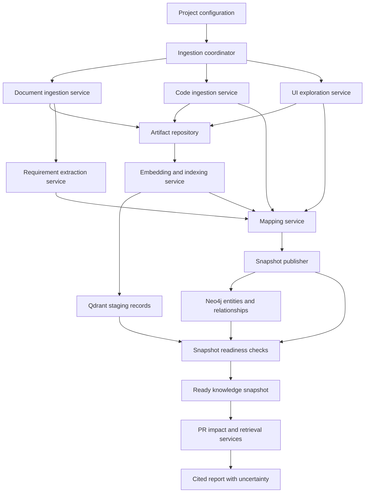
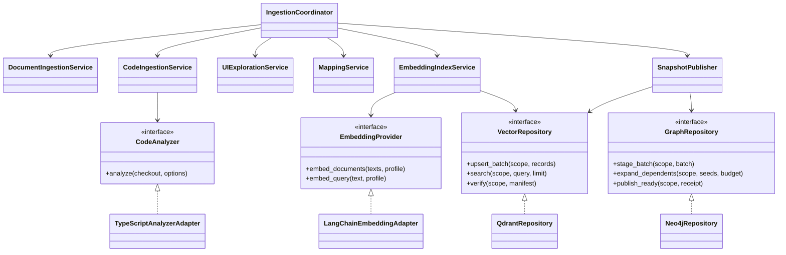

> Historical design: some paths and proposed capabilities below are superseded. See the current [folder guide](../folder-structure.md) and [evaluation results](../evaluation-results.md).

# Knowledge ingestion and impact analysis LLD review draft

**Status: proposal for review, not an implementation specification approved for execution.** Prepared on 2 October 2026. This document proposes replacing the current document-focused storage design with a knowledge platform that separates relationships, semantic retrieval, and original evidence. Review this document and suggest changes before implementation starts.

The proposed split is **Neo4j for relationships, Qdrant for searchable text and embeddings, and artifact storage for original evidence**. LangChain sits behind model and embedding adapters. Code analysis and validation remain deterministic where possible. The system must explain how a real pull request could affect UI flows and documented requirements, with citations and explicit uncertainty.

The existing implementation is described in [the current LLD](low-level-design.md). That document describes shipped code; this document describes proposed changes. No application code, database schema, or dependency changes are part of this review draft.

## 1 What exists and what changes

| Capability | Current state | Proposed state |
|---|---|---|
| Public document collection | Implemented; 9 Saleor sources produced 121 chunks | Preserve and extend through source adapters |
| Structured requirement extraction | LangChain adapter and validation implemented; live run pending | Retain, add review decisions and versioned requirement observations |
| Neo4j | Loader implemented; live loading not verified | Store code dependencies, UI structure, requirements, evidence references and mappings |
| Full chunk text in graph | Current loader stores it | Move retrieval text to Qdrant; original text remains in artifact storage |
| Embeddings and vector retrieval | Not implemented | Add Qdrant indexes and explicit embedding profiles |
| Code dependency ingestion | Not implemented | Add compiler-based analysis for TypeScript and React first |
| Autonomous UI exploration | Not implemented; existing screenshots are manual setup evidence | Add bounded autonomous exploration with reproducible browser observations |
| Requirement and UI and code mapping | Not implemented | Add evidenced mapping candidates, review, and accepted links |
| PR impact and RAG report | Not implemented | Combine diff analysis, graph traversal, retrieval and cited generation |

The assignment still requires all four capabilities: autonomous browser exploration, structured document ingestion, a Neo4j graph connecting requirements/UI/code, and understandable impact analysis for a real public PR. Final evaluation, the design write-up and demonstration remain deliverables. RAG supports the solution; it does not replace any of these requirements.

## 2 Design decisions proposed for review

| Decision | Proposed choice | Reason and tradeoff |
|---|---|---|
| Relationship store | Neo4j | Required by the assignment; suitable for dependency and traceability queries |
| Retrieval store | Qdrant | Separate searchable passages from graph structure; adds operational and consistency work |
| Original evidence | Local content-addressed files initially, object-storage adapter later | Originals can be audited or reindexed without treating the vector index as the only copy |
| Model integration | LangChain provider adapters | Structured extraction and embedding integrations without coupling domain classes to SDKs |
| Workflow execution | Explicit Python application services | Clear state transitions, checkpoints and error ownership; no agent loop for deterministic ingestion |
| Code analyzer | Node worker using TypeScript compiler APIs, exposed through a Python port | Resolve TypeScript symbols and imports with project context; other languages require adapters |
| Browser engine | Playwright through a browser port | Capture DOM, screenshots, actions and transitions; the planner is separate from execution |
| Coordination | One orchestrator host initially, durable run manifests and exclusive run locks | Reliable recovery without prematurely adding a distributed job system |
| Service boundary | CLI first, reusable services underneath | A REST API can call the same use cases later; no HTTP server is required for this assignment |

Provider-specific APIs and supported versions must be verified when implementing. Exact extraction, embedding and reranking models remain review decisions; no hidden model default is proposed.

## 3 Architecture and data ownership



The publisher also receives structural entities directly from document, code and browser services. Structural entities and vector records can be staged before mapping; an internal staging retriever lets the mapping service read those verified records without making them available to public queries. Readiness is evaluated against the requested capabilities of the snapshot.

| Store | Authoritative for | Stored values | Excluded |
|---|---|---|---|
| Artifact repository | Original and canonical extracted evidence | Raw documents, normalized text, source files, analysis JSON, DOM, screenshots, extraction outputs and manifests | Database secrets and browser authentication state |
| Neo4j | Published entities, relationships, review history, coverage and snapshot readiness | IDs, short labels/statements, conditions, revision metadata, graph edges, evidence references | Entire source files, full documentation text, screenshot binaries and embeddings |
| Qdrant | Rebuildable semantic search index | Dense vectors, optional sparse vectors, bounded chunk text, filtering metadata and graph/artifact IDs | Authoritative publication state, complete graph dependencies and original binary evidence |

Some short text appears in more than one store on purpose: a requirement statement is useful as a graph label and as searchable content. Full source passages should not be duplicated into Neo4j. A lost Qdrant collection can be rebuilt from canonical artifacts and the embedding profile.

## 4 Inputs and immutable context

The manifest describes an application, not a specific PR fix. It must declare:

- Project ID and display name.
- Repository URL, exact baseline commit, code roots, include/exclude rules and language/framework adapters.
- Baseline application URL, allowed navigation origins and deployment-to-commit evidence.
- Explicit document sources, authority, scope, version or retrieval timestamp.
- Browser context: viewport, locale, channel, test identity reference, fixture manifest and exploration budget.
- Extraction model profile, embedding profile, index schema version and retrieval settings.
- Required capabilities for publication, such as documents plus code, or documents plus code plus UI mappings.

For Saleor, the code mapped to observed baseline UI must use deployed baseline commit `6e55bd8b924c0341e21a85d4666ca510838ed4e5`. The original PR comparison uses `23bc49ccd22e13e182b30daff562d5e5c9af874c` and `221be2247f5b1a8ef94f007639fe83f53a6384b8`. Those revisions differ because identical deployment compatibility changes were applied to both storefront variants. Keep both concepts explicit in the experiment manifest.

Backend documentation is currently unpinned online documentation. Record its retrieved content hash and declared authority; do not silently assume it exactly matches the running Saleor backend. Record backend version and fixture state with every crawl.

**Excluded from baseline knowledge:** PR descriptions/diffs, patched observations, manual reference requirements, and manual validation outcomes. These remain separate evaluation or later analysis inputs. No real payment or order completion is needed.

## 5 Domain objects and stable identities

| Object | Required fields and meaning |
|---|---|
| `ProjectConfig` | Schema version, project ID, source specifications, repository context, app context, adapter profiles and budgets |
| `IngestionRun` | Run ID, project ID, requested capabilities, status, stage checkpoints, errors and timestamps |
| `KnowledgeSnapshot` | Snapshot ID, baseline context, source manifest hash, tool/profile versions, capability results and publication state |
| `ArtifactRef` | Content hash, media type, byte count, storage URI and optional span |
| `DocumentSnapshot` | Source identity, URL, authority, version, retrieval time and raw/normalized artifact references |
| `TextChunk` | ID, kind, parent ID, text artifact/span, token count, heading or symbol context and content hash |
| `RequirementObservation` | Statement, actor, preconditions, behavior, expected outcome, exceptions, source layer, validation and supporting evidence IDs |
| `CodeSymbol` | Snapshot, relative file path, qualified name, kind, source span, declaration hash and analyzer version |
| `DependencyObservation` | Source/target IDs, relation type, evidence span, resolution status and analyzer provenance |
| `ScreenState` | URL, normalized DOM fingerprint, context fingerprint, DOM/screenshot references and crawl run ID |
| `UIElement` | State ID, role, accessible name, locator candidates, relevant attributes and observed visibility/enabled state |
| `Transition` | Before/after states, action, target element, outcome, timings and evidence IDs |
| `MappingCandidate` | Source/target entities, mapping type, method, evidence IDs, uncertainty reasons and review state |
| `CoverageAssessment` | Requirement, crawl context, status, supporting observations, attempted checks and limitation reasons |
| `RetrievalHit` | Chunk/entity/artifact IDs, scoped context, retrieval scores, text, citations and provenance |
| `ImpactFinding` | Changed symbol, dependency paths, affected UI/requirements, evidence, severity rationale and uncertainty |

Use UUIDs for run/snapshot attempts. Use deterministic IDs within a snapshot for graph entities and vector points. Canonical hashing must sort object keys and normalize relative paths while respecting repository path case. Byte offsets are authoritative for code spans; display line/column coordinates are derived consistently. Content hashes remain independent of run IDs, allowing immutable artifact reuse.

Example entity identity: hash of project ID, snapshot ID, entity kind, relative path and qualified declaration identity. A Qdrant point ID is a deterministic UUID derived from snapshot ID, chunk ID and embedding profile ID. This fits Qdrant's UUID point identifiers. [Qdrant point model](https://qdrant.tech/documentation/manage-data/points/)

Cross-revision symbol identity is a separate correspondence problem. File renames or moved declarations must not be treated as identical solely because their names match. Record exact rename evidence or a tentative match with reasons.

## 6 Neo4j schema

All snapshot-owned nodes carry `project_id`, `snapshot_id` and a globally unique `id`. Content-bearing labels also carry compact display metadata and evidence references. `Project` and stable source identities are project-scoped; observations are snapshot/run-scoped.

| Node labels | Important properties |
|---|---|
| `Project`, `KnowledgeSnapshot`, `IngestionRun` | Identity, context hashes, status, required/available capabilities, stage receipts |
| `Source`, `DocumentSnapshot`, `ChunkRef` | Authority, source version, hashes, artifact references; no full chunk text |
| `ExtractionRun`, `RequirementObservation` | Model/prompt/policy versions, structured requirement fields and validation |
| `RepositoryRevision`, `CodeFile`, `CodeSymbol`, `ExternalPackage`, `ApiOperation` | Commit, path, symbol kind/span, package version and operation name |
| `CrawlRun`, `ScreenState`, `UIElement`, `Transition`, `UserFlow` | Browser context, state identity, action outcome and artifact references |
| `MappingCandidate`, `ReviewDecision`, `CoverageAssessment` | Evidence, method, reviewer decision, status, rationale and assessment scope |
| `AnalysisRun`, `ImpactFinding` | PR identity, base/head commits, graph snapshot, retrieval context and report artifact |

Proposed relationships:

```text
Project              -HAS_SNAPSHOT->       KnowledgeSnapshot
KnowledgeSnapshot    -HAS_ENTITY->         snapshot-owned entity
Source               -HAS_VERSION->        DocumentSnapshot
DocumentSnapshot     -HAS_CHUNK->          ChunkRef
ExtractionRun        -PRODUCED->           RequirementObservation
RequirementObservation -CITES->            ChunkRef

RepositoryRevision   -CONTAINS->           CodeFile
CodeFile             -DEFINES->            CodeSymbol
CodeFile             -IMPORTS->            CodeFile or ExternalPackage
CodeSymbol           -CALLS->              CodeSymbol
CodeSymbol           -RENDERS->            CodeSymbol
CodeSymbol           -USES_OPERATION->     ApiOperation

CrawlRun             -OBSERVED->           ScreenState
ScreenState          -CONTAINS->           UIElement
Transition           -FROM_STATE->         ScreenState
Transition           -TO_STATE->           ScreenState
Transition           -ACTED_ON->           UIElement
UserFlow             -HAS_STEP->           Transition

MappingCandidate     -FROM_ENTITY->        RequirementObservation or UIElement
MappingCandidate     -TO_ENTITY->          UIElement or CodeSymbol
MappingCandidate     -SUPPORTED_BY->       evidence reference
ReviewDecision       -DECIDES->            MappingCandidate
CoverageAssessment   -ASSESSES->           RequirementObservation
CoverageAssessment   -BASED_ON->           Transition or ScreenState
```

Store evidence spans, analyzer versions and resolution methods on structural dependency relationships. Unresolved targets become separate unresolved-reference records, not invented `CALLS` edges. `UserFlow` step relationships carry an explicit ordinal.

For accepted cross-layer mappings, materialize `MAPPED_TO` and `IMPLEMENTED_BY` edges with a `mapping_id` linking back to the candidate and review evidence. Deterministic mappings may be accepted by an explicit policy; semantic-only candidates require review initially. After publication, a changed review decision produces a new snapshot/mapping version whose accepted edges reflect the change. Prior published snapshots remain unchanged so old reports are reproducible.

Create uniqueness constraints on node IDs and indexes supporting project/snapshot filtering, symbol lookup and review status. Every query must resolve a readable snapshot first. Do not rely on project IDs alone for security isolation if a multi-user API is later introduced.

## 7 Vector schema and retrieval content

Use collections named by index schema and embedding profile, for example `knowledge_v1_<profile_id>`. Documents, requirement descriptions and selected code chunks can share a collection when they use the same embedding profile. Different vector dimensions or incompatible embedding models require separate collections or an explicitly designed migration.

Each point contains:

```json
{
  "id": "deterministic UUID",
  "vector": "embedding values generated by the selected profile",
  "payload": {
    "project_id": "saleor-storefront",
    "snapshot_id": "immutable snapshot identifier",
    "chunk_id": "canonical chunk identifier",
    "kind": "document | requirement | code | ui_description",
    "entity_ids": ["graph entity identifiers"],
    "artifact_uri": "content-addressed evidence reference",
    "content_hash": "sha256",
    "text": "bounded searchable passage",
    "heading_or_symbol": "passage context",
    "source_authority": "frontend_spec | backend_contract | api_contract | code | observation",
    "source_version": "source revision or retrieval version",
    "repository_commit": "commit when relevant",
    "embedding_profile_id": "model and preprocessing fingerprint",
    "index_schema_version": 1
  }
}
```

This is a conceptual schema; optional fields are absent when not applicable. Qdrant supports payload filtering, which will be used to constrain project, snapshot and content kind. The adapter must refuse searches without project/snapshot scope rather than depending on every caller to remember those filters. [Qdrant filtering](https://qdrant.tech/documentation/search/filtering/)

An `EmbeddingProfile` fixes provider, model identifier, dimensions, distance metric, tokenizer/preprocessing version and input limits. Choose those together; dimensions must never be guessed. Query and document vectors use the same profile. Re-embedding creates a new index version and is published only after validation.

Do not embed entire repositories as one string. Documentation is split by headings and blocks. Code chunks follow declarations with imports, signature and enclosing context. Large declarations split into linked spans without losing file/line references. UI descriptions are optional derived text linked to original DOM/screenshots; screenshots remain artifacts.

## 8 Packages and class responsibilities

```text
trace_impact/
  domain/          contracts, policies, errors, identities
  application/
    ports/         source, code, browser, models, storage, retrieval
    ingestion/     documents, requirements, code, UI, mappings, indexing
    publication/   readiness validation and publication
    analysis/      retrieval, dependency traversal, reports
  infrastructure/
    sources/       HTTP, local files, Git
    code/          TypeScript worker bridge, framework adapters
    browser/       Playwright executor and observation capture
    llm/           LangChain extraction, embeddings and report adapters
    persistence/   Neo4j, Qdrant, local artifacts, run manifests
    observability/ events and metrics
  bootstrap.py     composition root and resource ownership
  cli.py           arguments and exit status
```

| Service or class | Responsibility | Dependencies |
|---|---|---|
| `IngestionCoordinator` | Execute the requested stage plan and checkpoint it | Run repository, stage services, budget policy, event sink |
| `DocumentIngestionService` | Fetch sources, snapshot, normalize and chunk | Reader registry, parser registry, chunking policy, artifacts |
| `RequirementExtractionService` | Extract every in-scope chunk and validate candidates | Structured extractor, grounding policy, cache, artifacts |
| `CodeIngestionService` | Pin a checkout, analyze files, retain dependencies and diagnostics | Repository provider, analyzer registry, artifacts |
| `UIExplorationService` | Explore the baseline within policy and budgets | Action planner, browser session, observation normalizer, artifacts |
| `MappingService` | Generate and validate candidate cross-layer links | Graph staging view, retriever, mapping policy, review repository |
| `EmbeddingIndexService` | Embed changed canonical chunks and stage vectors | Embedding provider, vector repository, embedding cache |
| `SnapshotPublisher` | Check manifests and store receipts, then publish readiness | Graph repository, vector repository, artifacts, run repository |
| `KnowledgeRetriever` | Scope and combine semantic, exact and graph evidence | Vector repository, exact-search adapter, graph repository, evidence reader |
| `StagingRetriever` | Internal mapping access to verified staged source/code/UI evidence | Coordinator-issued staging scope, stage receipts and retrieval adapters; never exposed as a user query endpoint |
| `ImpactAnalysisService` | Analyze changes and traverse dependent entities | Diff provider, symbol resolver, dependency policy, retriever |
| `ReportService` | Produce structured findings and a readable cited report | Report generator, citation validator, artifacts |
| `ApplicationContainer` | Choose concrete adapters and own their lifecycle | Validated settings and adapter factories |

Use Strategy for language readers/analyzers and policies, Adapter for external systems, Repository for persistence, and constructor injection for substitutable dependencies. The coordinator implements an explicit workflow state machine. It should not grow into a universal service locator. Pure hashing and validation helpers remain functions.



This diagram shows the main ingestion/storage boundaries. Browser, artifact, model, mapping-policy and event ports follow the same constructor-injection rule described in the tables and contracts.

## 9 Interface contracts

These signatures are design sketches inside this document, not executable implementation changes. Concrete SDK classes and Neo4j/Qdrant clients must not appear in application service signatures.

```python
class CodeAnalyzer(Protocol):
    def analyze(self, checkout: RepositorySnapshot,
                options: AnalysisOptions) -> CodeAnalysis: ...

class BrowserSession(Protocol):
    def observe(self) -> BrowserObservation: ...
    def execute(self, action: BrowserAction) -> ActionResult: ...
    def close(self) -> None: ...

class RequirementExtractor(Protocol):
    def extract(self, chunk: TextChunk,
                context: ExtractionContext) -> ExtractionResult: ...

class EmbeddingProvider(Protocol):
    def embed_documents(self, texts: list[str],
                        profile: EmbeddingProfile) -> EmbeddingBatch: ...
    def embed_query(self, text: str,
                    profile: EmbeddingProfile) -> EmbeddingVector: ...

class VectorRepository(Protocol):
    def upsert_batch(self, scope: SnapshotScope,
                     records: list[VectorRecord]) -> BatchReceipt: ...
    def search(self, scope: SnapshotScope, query: SearchQuery,
               limit: int) -> list[VectorHit]: ...
    def verify(self, scope: SnapshotScope,
               expected: IndexManifest) -> VerificationResult: ...

class GraphRepository(Protocol):
    def stage_batch(self, scope: SnapshotScope,
                    batch: GraphBatch) -> BatchReceipt: ...
    def expand_dependents(self, scope: SnapshotScope,
                          seeds: list[EntityId], budget: TraversalBudget) -> ImpactSubgraph: ...
    def publish_ready(self, scope: SnapshotScope,
                      receipt: PublicationReceipt) -> None: ...
    def resolve_ready(self, selector: SnapshotSelector) -> SnapshotScope: ...

class ArtifactRepository(Protocol):
    def put(self, content: bytes, media_type: str) -> ArtifactRef: ...
    def read(self, reference: ArtifactRef) -> bytes: ...

class RunRepository(Protocol):
    def checkpoint(self, run: IngestionRun) -> None: ...
    def lock(self, run_id: str) -> ContextManager: ...

class MappingPolicy(Protocol):
    def assess(self, candidate: MappingCandidate,
               evidence: list[Evidence]) -> MappingDecision: ...
```

Ports return domain objects and typed errors. They must not return unstructured provider responses. Embedding batches preserve input ordering and return usage/model identity. Receipts include batch ID, entity count and content digest; a successful HTTP request alone is not proof that the correct records were published.

## 10 Document and requirement ingestion

1. Validate configuration and determine the exact source manifest before fetching.
2. Read through approved adapters with timeouts, size limits and redirect policy.
3. Save raw and normalized evidence, including content hashes and retrieval metadata.
4. Chunk by document structure with token-aware limits for the selected models; retain neighboring section references.
5. Extract atomic requirements using a versioned LangChain structured-output adapter. All in-scope chunks are processed; extraction does not depend on retrieving a few top matches.
6. Validate exact quotations, required fields, layer and source authority. Mark unsupported claims rejected and inferred/ambiguous claims for review.
7. Preserve original candidates and extraction outputs. Exact duplicates can be consolidated without losing evidence. Semantic duplicates and contradictory rules become review candidates.
8. Create compact graph entities and vectorizable passages. No browser coverage is inferred from documentation.

The extraction cache key includes content/context hash, source authority, prompt version, output schema, model profile and generation parameters. Grounding-policy changes can revalidate cached extraction output without re-calling the model. Unpinned provider model aliases limit exact repeatability and must be recorded as such.

## 11 Code ingestion and dependency limits

Use a pinned repository snapshot. Exclude `.git`, build output, dependency directories, secrets, large binaries and unrelated generated output. Read package manifests/lockfiles to represent external dependency boundaries. Generated GraphQL declarations used by the application may be analyzed selectively, but should not dominate embeddings.

For TypeScript, a Node worker uses the compiler API with the repository's `tsconfig` and appropriate compiler version. It emits versioned JSON/NDJSON contracts to the Python adapter. The worker has a deadline, bounded output and an explicit working directory. Parse failures and unresolved module paths are diagnostics, not silent omissions. Microsoft documents compiler programs, AST traversal and symbol/type-checker access in its [Compiler API guide](https://github.com/microsoft/TypeScript/wiki/Using-the-Compiler-API).

The first analyzer covers imports/re-exports, declarations, resolvable direct calls, JSX component references and GraphQL operation references. A Next.js adapter interprets supported routing conventions. Code and framework adapters are distinct so another React application need not inherit Saleor or Next.js assumptions.

Do not promise every runtime dependency. Dynamic imports, reflection, dependency injection, callback dispatch, runtime configuration and third-party internals may remain unresolved. Record resolution status and the missing information. An import indicates potential coupling, not proof that every imported symbol executes.

Dependency direction is caller/importer to callee/dependency. Impact expansion walks incoming dependency relationships from a changed symbol to its dependents. Use a visited set, relationship allowlist, hop/node/time budgets and explicit truncation indicators. Cycles are expected and must terminate. Start with precise symbol relationships, then use labeled file-level fallback where resolution fails.

For another language, supply a `CodeAnalyzer` adapter and conformance fixtures. Manifest portability is not a claim that one parser understands every language.

## 12 Autonomous UI ingestion

The planner selects actions from current observations; Playwright executes them and records evidence. It must autonomously discover controls and navigation rather than replay the earlier manual test sequence as if it were exploration. Seed URLs and fixture values are allowed configuration; discovered UI relationships must come from the crawl.

Each cycle is observe, enumerate eligible actions, select under exploration policy, execute, observe again, and record the transition. Prefer role/name/label locators, with inspected attribute or CSS fallback and ambiguity checks. Playwright's actionability and locator behavior provide execution primitives, not an exploration policy. [Playwright actionability](https://playwright.dev/docs/actionability)

Deduplicate states using normalized route, meaningful DOM/accessibility structure and relevant business context. Ignore known volatile tokens/timestamps while retaining cart, modal, validation and selection state. Record the fingerprinting algorithm version and representative raw evidence so collisions can be investigated.

Set limits on actions, depth, states, elapsed time and repeated failures. Stop at forbidden transaction boundaries. Use synthetic test identities and isolated sessions; capture no passwords or authentication tokens in artifacts. Record blocked authentication, unavailable fixtures and navigation failures as limitations.

Coverage states are `NOT_EVALUATED`, `OBSERVED`, `NOT_OBSERVED`, `BLOCKED` and `CONTRADICTED`. `OBSERVED` requires a behavior-specific check with preconditions and outcome evidence. A visible button alone only establishes a UI observation. `NOT_OBSERVED` means exploration did not find evidence within its recorded scope and budget; it does not mean the feature is absent.

## 13 Mapping requirements to UI and code

Generate candidates from exact identifiers, route/component associations, observed API operations, source labels and semantic retrieval. Similar labels alone are weak evidence. A browser DOM snapshot normally does not reveal which React source symbol produced it; stronger mapping may require source analysis, approved instrumentation, or multiple independent signals.

Each candidate retains its endpoints, method, evidence IDs and uncertainty reasons. Classify evidence as deterministic, observed, inferred or human-reviewed. Do not invent percentage confidence. Any model relevance score is retained as an uncalibrated ranking signal until evaluated.

Automatic acceptance initially requires a documented deterministic rule and valid evidence references. Semantic-only candidates enter review. A review decision is an append-only object with reviewer identity, timestamp and rationale. Accepted relationships are usable for evidence-backed impact paths; tentative paths are reported separately as hypotheses.

New model/policy versions produce a new mapping run. They cannot overwrite the evidence or decisions from earlier runs. Requirements with no accepted mappings remain visible as coverage gaps.

## 14 Embedding and hybrid retrieval

Canonical document, requirement and code chunks are embedded in bounded batches. Cache embeddings by content/preprocessing/profile hash. Validate batch lengths, dimensions, finite numeric values and response ordering before upsert. Successful batches are checkpointed. Retry transient provider failures with bounded backoff; permanent input/schema errors require correction.

The proposed first retrieval recipe is configurable: retrieve up to 20 dense matches, retrieve up to 20 lexical matches, combine using reciprocal rank fusion, deduplicate canonical chunks, and assemble evidence under a context-token budget. These are starting parameters, not measured optimal values.

Lexical retrieval needs a real index: the proposal is a sparse index in Qdrant using an explicitly versioned lexical encoding strategy. It must be implemented and evaluated separately from dense embeddings. Exact symbol/API lookup in Neo4j is an additional path. Optional model reranking is off initially and can be added only if evaluation shows benefit.

For every user/report query, first resolve a READY snapshot and its capabilities. Apply project, snapshot, content-kind and source-authority filters to retrieval. Expand relevant graph relationships with bounded traversal, read cited artifact spans, and validate that evidence belongs to the selected context. Reserve space for contradictory evidence and uncertainty rather than keeping only agreeing passages.

The mapping stage is a deliberate exception to public readiness: `StagingRetriever` accepts an internal staging scope issued only to the owning coordinator after verifying the relevant structural/vector batches. It cannot select an arbitrary project, return data from other runs, or serve user questions. This prevents a circular dependency in which mapping requires retrieval but retrieval requires mapping to have already been published.

The generator receives a structured evidence bundle with citation IDs. It may cite only supplied IDs. A validator rejects unknown citations and checks that factual findings have evidence. If retrieval is empty or mapping is incomplete, return an explicit insufficient-evidence result; do not silently answer from model memory. Qdrant documents dense/sparse prefetch and fusion mechanisms; the proposed retrieval parameters still need evaluation on this corpus. [Qdrant hybrid queries](https://qdrant.tech/documentation/search/hybrid-queries/)

## 15 PR impact analysis sequence

1. Capture repository identity, PR number, exact base/head commits and comparison policy.
2. Diff the intended revisions, including renames, additions and deletions. Resolve changed spans against the correct version's symbols.
3. Map comparable symbols to the baseline knowledge snapshot; record ambiguous correspondences. Deletions start from baseline symbols; additions need head-side analysis and may have no baseline UI mapping.
4. Expand incoming code dependencies within budget. Preserve each path and its evidence quality.
5. Follow accepted UI and requirement mappings. Collect tentative paths separately.
6. Retrieve supporting requirements and code/document passages from Qdrant under the corresponding snapshot scopes. Keep head and baseline evidence labeled separately.
7. Generate a readable report covering changes, potentially affected flows, requirements, recommended checks, evidence and uncertainty.

The report must distinguish predicted risk from observed behavioral differences. Graph reachability is not a calibrated likelihood of failure. A changed UI label and a broken checkout operation should not receive identical severity solely because both have one graph edge.

The current upstream PR is merged. The demonstration is a replay over recorded pre-change and changed revisions, not a claim that we inspected it before its historical merge. Future open PRs use the same pinned base/head contract.

## 16 Publication across stores

There is no shared transaction across artifact storage, Qdrant and Neo4j. The design uses immutable staging plus a single Neo4j readiness gate.

```text
Run:       PENDING -> RUNNING -> VALIDATING -> PUBLISHING -> SUCCEEDED
                         |           |            |
                         +-----------+------------+-> FAILED or CANCELLED

Snapshot:  STAGING -> READY -> RETIRED
```

1. Allocate a snapshot ID and persist the requested capability manifest. The snapshot is STAGING.
2. Produce canonical source/analysis artifacts and freeze their base manifest. Stage structural graph and vector batches with deterministic IDs and verify their receipts.
3. Run optional mapping against that verified staging scope. Persist and freeze mapping/review outputs, then freeze a final publication manifest that includes both base and mapping artifacts.
4. Upsert the remaining graph/vector batches from the frozen final manifest, recording receipts. Public queries cannot read STAGING snapshots.
5. Verify expected IDs/counts and content/profile hashes, vector query visibility, graph endpoints, source versions and artifact existence. Counts alone are insufficient; compare the expected ID set or its verified digest.
6. In a final Neo4j transaction, record verification receipts, available capabilities and READY status, and update the project's current snapshot pointer if requested.
7. A reader resolves that pointer once at request start and uses the same snapshot ID throughout the request. If Neo4j cannot verify readiness, retrieval fails closed rather than querying arbitrary vector data.

Managed Neo4j transactions can retry transient failures; writes must therefore be idempotent. External model calls and Qdrant writes must not execute inside a retried Neo4j transaction callback. [Neo4j transactions](https://neo4j.com/docs/python-manual/current/transactions/)

Initial coordination uses one host and an exclusive run lock. A second publisher cannot enter that run. Across-host leases and fencing are a future deployment change, not something a local file lock provides. Retrying a failed publication reuses the frozen payloads. Changed payloads or profiles require a new snapshot.

A docs-only snapshot can be READY for documentation retrieval while explicitly lacking code/UI/impact capabilities. An impact command must require the relevant capabilities and report missing ones. Budget-limited exploration can be a completed crawl with limitations, provided all attempted observations are durably recorded; it is not exhaustive coverage.

## 17 Failures and recovery

| Failure | Recorded result | Recovery |
|---|---|---|
| Source unavailable or malformed | Source failure; required document capability incomplete | Fix/retry source stage; do not declare collection complete |
| Model timeout or rate limit | Failed batch/chunk with safe code and attempt count | Bounded adapter retry; resume only unfinished items |
| Model refusal or invalid schema | Rejected extraction attempt | Review/correct input or model settings; never fabricate candidates |
| Corrupt checkpoint/cache | Explicit artifact error | Preserve evidence, stop dependent work, repair or regenerate intentionally |
| Code parser fails on a file | File diagnostic and reduced analysis coverage | Retry with corrected analyzer/configuration; retain unresolved scope |
| Browser loop or blocked flow | Recorded stop reason, budgets and last evidence | Continue from eligible frontier or finish with scoped limitations |
| Qdrant fails after graph staging | Snapshot remains STAGING | Resume missing vector batches and verify before publication |
| Neo4j READY commit response is lost | Outcome initially unknown | Read snapshot state; safely repeat only if not already committed |
| Referenced evidence missing | Integrity validation fails | Restore/regenerate artifact; block publication |
| Process interrupted | Last durable checkpoint, no false READY state | Resume using the run manifest and frozen publication artifacts |

Cleanup of old STAGING snapshots is explicit and retention-based. It must not remove active/READY snapshots or evidence referenced by retained reports. Deletion and retention commands are separate from normal ingestion.

## 18 Operational controls

Structured events carry run/project/snapshot IDs, stage, safe error code, duration, counts, retries, cache hits and provider usage. Never log source secrets, browser cookies, full prompts or raw provider exception bodies. Persist run-level usage totals; per-request events alone are insufficient for budget enforcement.

Set model-call, input-token, output-token, crawl-action and elapsed-time budgets. Reserve estimated usage before dispatch and reconcile actual usage afterward; stop before exceeding the configured envelope. Monetary budgets require a verified provider pricing profile and remain unavailable until configured.

Connection timeouts, batch sizes and concurrency are configuration, with validated bounds. Begin with one orchestrator and bounded model/embedding workers; do not add unlimited parallel calls. Load tests determine safe production limits.

For a future multi-user service, authenticate callers, authorize project access before creating snapshot scopes, isolate storage credentials and restrict egress. An allowlist supplied by an untrusted caller is not adequate SSRF protection. Source ingestion must not execute repository instructions or package scripts automatically; any required build/dependency preparation is a separate controlled operation.

Backups must cover Neo4j plus original artifacts and manifests. Qdrant is rebuildable, but snapshots/backups may reduce restore time. Define retention, encryption and backup/restore procedures for the chosen deployment before making a production-readiness claim.

## 19 Evaluation and acceptance criteria

| Area | Test or measurement | Acceptance proposal |
|---|---|---|
| Extraction | Human-labeled requirements from a held-out document set | Report precision, recall, unsupported-claim rate and condition preservation; agree numeric targets after labeling |
| Citation integrity | Resolve every output evidence ID and span | No dangling citations in a published snapshot/report |
| Code analysis | Known imports/calls/re-exports/JSX, aliases, cycles and unresolved dynamic calls | Expected fixture edges match; unsupported references remain explicit |
| UI exploration | Repeated bounded runs over known reachable flows | Compare state/transition discovery, behavior evidence and repeatability; no manual path disguised as autonomous output |
| Mapping | Labeled requirement/UI/code pairs | Measure precision/recall separately for accepted and tentative links |
| Retrieval | Labeled queries with expected source passages | Compare lexical-only, dense-only and hybrid recall at k and ranking quality |
| Impact analysis | Selected real PR plus held-out changes | Evaluate affected-flow recall, false alarms, citation correctness and uncertainty |
| Isolation | Two projects and two revisions with similar text/symbols | No cross-project or unintended cross-revision retrieval or graph paths |
| Recovery | Inject failure before and after each publication stage | No partial snapshot becomes READY; retries do not duplicate records |
| Regression | Reindex unchanged inputs and compare manifests | Stable canonical identities and structural outputs; LLM variability is measured and cached |
| Operations | Representative corpus, outage and restore tests | Measure latency, memory, database load and cost before defining SLOs |

Use the manually curated Saleor requirements and earlier manual observations only as evaluation references. Separate tuning examples from held-out cases. Test doubles verify contracts; they do not establish real model quality or real database behavior.

## 20 Example of the complete flow

Illustrative example, not a claim that these mappings have already been discovered:

1. A documentation passage describes voucher eligibility. Its original text is an artifact; a searchable chunk and embedding go into Qdrant.
2. Extraction produces a requirement observation with conditions and a citation. Its compact structured representation and `CITES` link go into Neo4j.
3. Compiler analysis finds a checkout component using a voucher API operation. That structural relationship and its source span go into Neo4j; the declaration's text is available through artifacts and Qdrant.
4. The browser observes a voucher control, performs an eligible action and records the resulting state. DOM and screenshots are artifacts; states/elements/transitions are graph nodes.
5. The mapping service proposes requirement-to-behavior and behavior-to-component links with evidence. Accepted links are available to impact traversal; ambiguous links remain review items.
6. A PR changes the relevant code. Graph traversal identifies candidate affected flows, and retrieval supplies the original supporting passages. The report explains the risk and what remains unverified.

This is why the graph retains requirement and UI identities even though the long text lives elsewhere: those identities connect the dependency path to understandable product behavior.

## 21 Migration from the current implementation

After design approval, implement in independently reviewable slices:

1. Finalize contracts, source/version identity, embedding profile and snapshot capabilities. Keep current artifacts readable through a versioned migration adapter.
2. Add Qdrant and embedding ports/adapters with contract tests. Index the existing document corpus from canonical artifacts.
3. Introduce compact graph references and the publication gate. Preserve the existing loader as a versioned compatibility path until migration is verified.
4. Add scoped hybrid retrieval and retrieval evaluation. Demonstrate document questions with verified citations.
5. Add TypeScript/React code ingestion and dependency fixtures. Verify the deployed baseline context.
6. Add autonomous browser exploration and evidence capture. Preserve the separation from manual evaluation artifacts.
7. Add reviewed mapping, coverage and PR analysis, followed by repeatability and failure-injection tests.
8. Complete the assignment report, runnable README, sample impact report and demonstration.

Do not delete prior runs or silently rewrite their IDs. Existing 121 chunks may be reused as input artifacts, but new profiles/schema/context produce a new knowledge snapshot. No live database migration is required until a live database actually exists and is inspected.

## 22 Decisions for your review

Please comment on these decisions before implementation:

1. **Storage:** Neo4j plus Qdrant plus local artifacts initially, with an object-storage adapter later.
2. **Scope:** TypeScript/React and the selected Next.js storefront first; other languages through explicit adapters.
3. **Models:** Choose extraction and embedding provider/model profiles; decide whether optional reranking should wait for retrieval evaluation.
4. **Mapping policy:** Automatically accept only well-supported deterministic links initially; send semantic-only mappings for review.
5. **Deployment:** Single-host orchestration first; distributed workers and multi-user API as later deployment scope.
6. **Delivery order:** Documents/vector retrieval, then code graph, then autonomous UI, then mapping and impact analysis.

You can review the architecture first, then the Neo4j/vector schemas, then the class contracts and publication flow. These are the decisions with the largest effect on the implementation. All items in this document remain proposals until your review.
