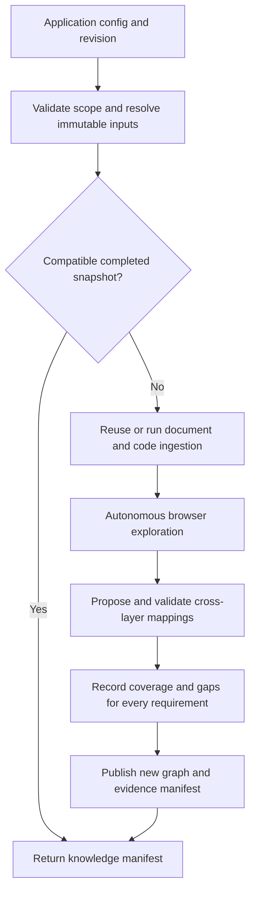
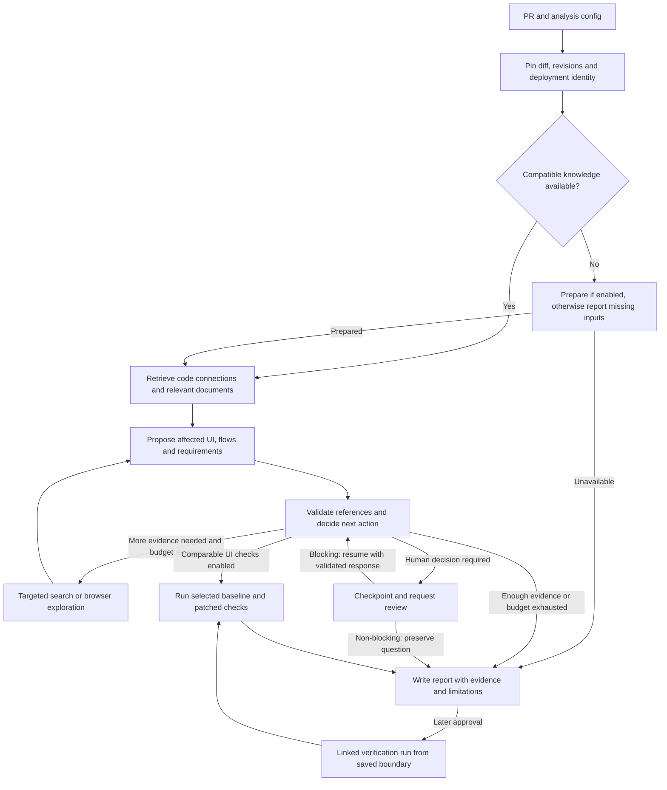

# Coordinator design proposal

Status: LIVE ADAPTERS IMPLEMENTED; the broader architecture below remains a roadmap. Reviewed against the current library and assignment on 2026-10-02. The independent package, bounded LangGraph workflow, JSON schemas, durable tool-call accounting, human review, GitHub diff adapter, existing-library retrieval adapter and Playwright navigation/observation/action tools are implemented in [packages/coordinator](../packages/coordinator/README.md). Current runtime contracts are documented there; the larger example configuration below is not an executable config. Confirmed cross-layer mappings, exhaustive autonomous exploration, paired behavioral assertions and full-agent golden-data evaluation remain subsequent milestones. Existing ingestion/retrieval implementation is unchanged.

The coordinator takes a PR and application configuration, gathers evidence, explores the UI when needed, and produces an understandable impact report. LangGraph controls the workflow. Existing ingestion and retrieval remain independent libraries.

## 1. Package boundary: easy to separate later

Keep one Git repository, with a separately installable coordinator package. This refines the earlier suggestion of a nested `trace_impact/coordinator` module: a sibling package provides a stronger extraction boundary without creating another repository today.

```text
repository/
  src/trace_impact/                  Existing library: unchanged
  configs/, schemas/, tests/        Existing library: unchanged
  packages/coordinator/             Proposed new package
    pyproject.toml                  Own dependencies and CLI
    uv.lock                         Own reproducible environment
    src/trace_coordinator/
      api.py                        prepare(), analyze(), resume()
      config.py                     Typed JSON definitions and validation
      models.py                     Versioned input/output records
      interfaces.py                 Replaceable component contracts
      bootstrap.py                  Construct registered implementations
      workflow.py                   LangGraph nodes, routes and joins
      state.py                      Small, serializable workflow state
      policy.py                     Budgets, evidence and failure decisions
      stages/                       Preparation, reasoning, verification, reporting
      browser/                      Bounded observe-decide-act subgraph
      adapters/                     Library, GitHub, models, browser and stores
      prompts/                      Versioned task prompts
    configs/, schemas/, tests/, docs/
```

Dependency direction: **coordinator stages -> coordinator interfaces <- adapters -> external implementations**. Only the local knowledge adapter imports `trace_impact`; core coordinator code does not import its models, shared utilities, registry, settings or databases. The existing library never imports the coordinator or LangGraph.

Use Python Protocols and small composed classes. Avoid a base-agent inheritance hierarchy. `bootstrap.py` performs dependency injection from an explicit provider registry. Adapters translate library objects into coordinator-owned, JSON-serializable records.

The `trace-impact` integration is an optional package extra. Local development can use an editable installation; release builds use a tested version range and lockfile, never a machine-specific path. Coordinator CI also runs with a fake knowledge adapter and without `trace-impact` installed. Later extraction moves `packages/coordinator` to a new repository; a future HTTP knowledge adapter can replace the local one without changing stages. HTTP transport is not required initially.

## 2. Two workflows, one coordinator

### Prepare application knowledge

Run this when evidence is missing, stale, or explicitly refreshed. Ordinary PR analysis reuses a pinned preparation manifest.



Ingestion uses existing JSON and checkpoints. A failed requirement extraction remains a recorded gap; 62 quote-grounded candidates are not automatically 62 semantically validated requirements. Preparation exports a manifest only after required artifacts are verified. Incomplete runs retain a resumable draft manifest, never masquerading as completed knowledge.

### Analyze a PR



Each unresolved question gets an ID. Each iteration must add evidence, resolve a question, or terminate. Configured round, time, action and token limits stop repeated unproductive searching. Browser exploration is required for the assignment's discovery layer; additional before/after regression execution is an optional extension.

## 3. What is an agent, and what is an ordinary tool?

| Component | Responsibility | Implementation choice |
| --- | --- | --- |
| Coordinator | Schedule stages, enforce policies, save progress | Deterministic LangGraph routing |
| PR reader | Resolve commits and complete diffs | GitHub/Git adapter, no LLM |
| Knowledge preparation | Collect/index documents and analyze code | Existing library adapter |
| Retrieval | Scoped graph queries and vector search | Existing library adapter; vector default, optional reranking |
| UI explorer | Choose useful actions from current browser observations | LLM decision loop with validated browser tools |
| Mapping stage | Propose requirement/UI/code relationships | Structured model output plus evidence checks |
| Impact planner | Suggest risks and focused follow-up work | Structured model output |
| Verification | Execute bounded checks and compare outcomes | Browser tools and deterministic assertions; ambiguous outcomes stay inconclusive |
| Report renderer | Turn validated findings into a QA-readable report | Deterministic template first; optional model-written summary |

LangGraph supports both predefined workflows and dynamic agent decisions. We use dynamic decisions inside bounded stages, with fixed outer control flow. This gives actual observation-driven exploration rather than a sequence of prompts. [LangGraph workflow and agent patterns](https://docs.langchain.com/oss/python/langgraph/workflows-agents).

The LLM never decides which database or project it may access, generates executable Cypher, changes budgets, or declares its own unsupported mapping confirmed. Graph queries remain parameterized application code.

## 4. Replaceable contracts

Names below are proposed interfaces, not existing implementations.

| Interface | Input -> output | First implementation |
| --- | --- | --- |
| `ChangeSource` | `ChangeRequest -> ChangeSet` | GitHub CLI/API; saved diff for offline tests |
| `KnowledgeProvider` | `PreparationRequest -> KnowledgeManifest`; graph/document requests -> evidence | `TraceImpactAdapter` |
| `BrowserSession` | navigate/observe/execute/close -> observations | Playwright adapter |
| `DecisionModel` | versioned task, evidence and response schema -> structured decision | LangChain provider adapters |
| `MappingValidator` | mapping claim and referenced artifacts -> assessment | Evidence rules; recorded human decisions |
| `UIKnowledgeStore` | observations/mappings/coverage -> immutable snapshot reference | Neo4j plus file artifacts |
| `ArtifactStore` | JSON, DOM, image or trace -> hashed artifact reference | Local files; future object storage |
| `ReportRenderer` | validated findings -> JSON and Markdown | Template renderer |

A new provider implements the relevant contract and registers its option schema. Selection then changes in JSON. A genuinely new stage still needs code and workflow routing; configuration does not invent capabilities. Checkpoint storage uses LangGraph's existing checkpointer interface rather than wrapping it in another unnecessary abstraction.

Adapters own connections and close them on completion/cancellation. Blocking library calls use bounded execution with provider timeouts; cancellation of an async wrapper alone is not assumed to cancel a remote request.

## 5. Data passed between stages

| Record | Essential fields |
| --- | --- |
| `AnalysisRequest` | schema version, project, repository, PR or explicit comparison, environment references, knowledge reference |
| `ChangeSet` | repository identity, PR head, base tip, comparison base, changed paths, before/after hunks, patch completeness, source hashes |
| `KnowledgeManifest` | project, ingestion run, code graph IDs/revisions, UI capture IDs, enriched graph IDs, corpus/model profile, scope, hashes, completion state |
| `EvidenceRef` | stable ID, kind, URI, content hash, source revision/run, capture time, redaction state |
| `ImpactPlan` | risk candidates, cited evidence, unresolved questions, bounded retrieval/browser tasks |
| `Finding` | UI/flow/requirement references, risk, evidence strength, rationale, verification result, limitations |
| `RunResult` | execution status, completeness, findings, gaps, coverage, usage, artifact references |

Boundary records use Pydantic validation and versioned JSON schemas. Unknown major versions fail clearly. Core records never expose Neo4j drivers, LangChain messages, Playwright page objects or current library model classes.

`CoordinatorState` stores request/config fingerprints, manifests, current stage, questions, finding IDs, completed task IDs, usage and errors. Large DOM/screenshot/trace data lives in artifacts, referenced by ID. Runtime dependencies and secrets stay outside checkpoint state.

Use separate fields for:

- execution: `RUNNING`, `WAITING_FOR_REVIEW`, `COMPLETED`, `COMPLETED_WITH_GAPS`, `FAILED`, `CANCELLED`;
- completeness: `COMPLETE_WITHIN_SCOPE`, `PARTIAL`, `INSUFFICIENT_EVIDENCE`;
- verification: `NOT_RUN`, `PASS`, `FAIL`, `INCONCLUSIVE`.

A completed workflow may have partial evidence. A successful report generation never means the application passed.

## 6. Browser discovery and the missing UI layer

The explorer repeats **observe -> choose action -> validate action -> execute -> capture transition**. It selects from observed elements, uses role/name/test-id locators when available, and records why it chose an action. CSS selectors are a fallback and are always tied to a capture.

Capture URL/route, relevant DOM and accessibility structure, screenshot, screen-state fingerprint, action, before/after states, timing, console errors and redacted network evidence. Screen identity includes meaningful state such as checkout step or voucher state; URL alone is insufficient. Stable transitions form discovered `UserFlow` records. Every attempted action, including failures, is recorded.

Bounds include allowed origins and redirects, route scope, maximum states, actions, duration, depth and repeated-state visits. Authenticated storage state is a secret reference. Cart/voucher mutations are permitted in the configured sandbox, with a fresh checkout per flow. Real payment/order submission is outside the initial action policy. Restore/reset setup before comparison; shared backend changes can otherwise contaminate results.

For Saleor, start with product -> cart -> guest checkout -> voucher interactions. Seed routes and fixture values guide discovery; they do not supply hard-coded answers about which flows a PR affects.

## 7. Graph integration without breaking the current schema

The existing impact graph already supports `CodeFile`, `CodeSymbol`, `UIElement`, `UserFlow` and `Requirement`, and the `RENDERS`, `CONTAINS`, `CHECKS` connections. Preserve those contracts.

1. Save detailed `Screen`, `Transition`, `MappingAssertion` and `CoverageAssessment` records in a separate versioned UI namespace in Neo4j, scoped by project, revision and crawl ID. DOM/images remain in the artifact store.
2. The adapter projects validated observations into existing `UIElement` and `UserFlow` shapes, and explicitly translates extracted requirements using a stable source-ID mapping. The document requirement graph and impact graph are not automatically the same graph.
3. Combine that projection with the immutable code snapshot and publish under a **new** impact snapshot ID. Never mutate the existing code snapshot or mix baseline/head nodes in one scoped snapshot.
4. The existing graph retriever reads this new compatible snapshot. Candidate mappings remain available as hypotheses in the UI store but never enter confirmed traversal.

Code-to-UI evidence can include static render/import paths tied to an observed role/text/test-id, source locations and, where available, runtime attribution. Text similarity alone is a proposal. Static render evidence plus UI observation supports a structural mapping; it does not prove that a runtime code path executed. Each mapping carries its method, provenance, validation status and alternatives.

Three-layer path: `CodeSymbol -> RENDERS -> UIElement <- CONTAINS <- UserFlow -> CHECKS -> Requirement`. Here `CHECKS` means the flow has a concrete observable check linked to the requirement; it does not mean the check passed. Execution results are separate.

Publication is staged: verify artifacts, publish UI records, publish the compatible impact snapshot, then atomically commit the manifest referencing both. Reads use committed manifests. Cross-store atomic transactions are not assumed; a failure leaves an unreferenced draft, resumable by content hash.

## 8. Absence, uncertainty and coverage

For **every in-scope requirement**, record a `CoverageAssessment`, even when there are no UI edges:

| Status | Meaning |
| --- | --- |
| `OBSERVED_TESTABLE` | Captured UI and a concrete observable check support the requirement |
| `NOT_OBSERVED_IN_SCOPE` | The planned scope was explored but supporting UI was not found |
| `BLOCKED` | Authentication, prerequisites or environment prevented inspection |
| `NOT_EXPLORED` | Budget or stage selection prevented inspection |
| `AMBIGUOUS` | Competing interpretations or mappings remain |

Include requirement ID, crawl/revision, explored scope, attempts, reason and evidence. Missing UI is not proof a feature is absent everywhere. Missing graph edges are not zero impact.

Keep requirement semantic validation, mapping confidence, predicted risk and observed behavior separate. Evidence strength uses explainable categories (`SUPPORTED`, `TENTATIVE`, `UNRESOLVED`) with reasons; retrieval scores and LLM self-confidence are not calibrated probabilities. Risk priority is a transparent configured rule over business criticality, change relevance and observed failures, not an invented confidence percentage.

Coverage at risk can be reported from supported dependency/mapping paths. **Observed coverage loss** requires comparable baseline/head captures or checks and evidence that a previously supported check is no longer available. Without head evidence, report predicted risk and the comparison gap.

## 9. PR and deployment correctness

Resolve commits once and retain immutable IDs. Distinguish the PR base tip, merge base and PR head; record which comparison defines the patch. Fetch all changed files/hunks; detect truncation, renames, deletions and binary files. Retrieve removed symbols from baseline and added symbols from head. If head analysis is unavailable, declare the added-code blind spot.

A merged PR is supported as a historical replay with recorded pre/post revisions; the report must identify that mode. Our Saleor deployment commits differ from upstream source commits because of setup changes. The adapter must verify the source-to-deployment mapping and identical setup-only changes using the saved manifest and Git evidence. The current baseline graph is pinned to the deployment revision, so upstream IDs cannot be substituted blindly.

Record backend version, channel, fixtures, flags, locale, viewport and capture time. Two storefronts sharing a mutable backend do not give an automatically controlled experiment. A comparison fails its comparability gate when deployment identity or fixture equivalence is unknown; static risk analysis may continue with an explicit gap.

## 10. JSON configuration

Use three distinct inputs:

- `application.json`: URLs, repository, source configs, routes, fixtures and secret references;
- `coordinator.json`: workflow profile, providers, models, limits, policies and persistence;
- `request.json`: PR/comparison and pinned preparation manifests for this run.

All files live under the new package's config directory. Existing ingestion/retrieval JSON is referenced, not duplicated. A run saves a resolved redacted configuration plus hashes of referenced files. Relative paths resolve against their owning config file, never the shell's working directory.

Example policy shape below is **proposed, not runnable configuration**. Provider implementations and schemas will be added after design review.

```json
{
  "schema_version": 1,
  "workflow": {
    "profile": "pr_impact_v1",
    "prepare_if_missing": false,
    "max_reasoning_rounds": 2,
    "verify_ui_changes": true
  },
  "providers": {
    "changes": {"provider": "github_cli", "options": {}},
    "knowledge": {"provider": "trace_impact_local", "options": {}},
    "browser": {"provider": "playwright", "options": {"headless": true}},
    "artifacts": {"provider": "filesystem", "options": {"root": "../runs"}}
  },
  "models": {
    "default": {
      "provider": "google_genai",
      "model": "SELECT_A_VALIDATED_MODEL",
      "api_key_env": "COORDINATOR_LLM_API_KEY",
      "temperature": 0,
      "timeout_seconds": 45,
      "max_output_tokens": 3000,
      "fallbacks": []
    },
    "roles": {"explorer": "default", "mapper": "default", "planner": "default"}
  },
  "retrieval": {
    "config_file": "SELECT_EXISTING_RETRIEVAL_JSON",
    "max_queries": 8,
    "max_evidence_items": 30
  },
  "browser_limits": {"max_states": 30, "max_actions": 80, "max_depth": 8},
  "execution": {
    "max_parallel_tasks": 2,
    "max_browser_sessions": 1,
    "max_model_requests_per_minute": 5,
    "max_run_seconds": 1200,
    "max_llm_calls": 60,
    "max_total_tokens": 80000,
    "retry": {"max_attempts": 3, "backoff_seconds": [2, 5], "jitter": true},
    "recursion_limit": 500
  },
  "evidence_policy": {
    "unresolved_mapping": "report_gap",
    "missing_credentials": "pause",
    "max_requirement_retrieval_failures": 1
  },
  "persistence": {"provider": "sqlite", "options": {"path": "../runs/checkpoints.sqlite"}},
  "report": {"formats": ["json", "markdown"], "llm_summary": false},
  "observability": {"events": "jsonl", "external_tracing": false}
}
```

Model name is intentionally unselected here; model/provider capability checks and a small contract evaluation precede choosing it. Explorer requires tool/structured-output support; screenshots sent to a model require vision support. Roles may share one inexpensive model initially and use independent providers/keys later. Reranking retains its existing separate configuration and defaults to off.

Schemas provide descriptions, examples, defaults, provider enums and provider-specific `options` definitions for editor completion. Unknown fields/providers fail before work starts. Cross-field validation rejects enabling UI verification without two environments, a preparation profile without a browser, or an incompatible checkpoint backend. API keys are environment/secret-manager references only. JSON selects registered code; it cannot load arbitrary Python import paths or execute expressions. Workflow profiles preserve mandatory validation and evidence checks even when optional stages are disabled.

## 11. LangGraph execution and recovery

Use `StateGraph` for the main workflows and a bounded browser subgraph. Use conditional edges for policy decisions; bounded workers may use `Send` with stable task IDs and a join that accounts for every planned task, including failures. Concurrent results are merged by task ID with conflict detection, not appended blindly. [LangGraph orchestration patterns](https://docs.langchain.com/oss/python/langgraph/workflows-agents).

Compile with a persistent checkpointer. Each analysis run gets its own opaque `thread_id`, retained on resume; project authorization is checked separately. SQLite is the local single-process option; Postgres is the proposed multi-worker deployment option. Neo4j and Qdrant remain knowledge stores, not workflow checkpoint databases. [LangGraph persistence](https://docs.langchain.com/oss/python/langgraph/persistence).

Human review has explicit `blocking` and `non_blocking` policies. Blocking review uses a dedicated
`interrupt` node and validated resume payload. Non-blocking review records the exact question,
routes directly to finalization, marks approval-dependent work `NOT_EXECUTED`, and returns
`COMPLETED_WITH_GAPS`. A later answer creates a linked checkpoint from the saved verification
boundary. It preserves the original evidence, hashes, audit events and call ledger; the elapsed
human-response interval is excluded from the active-execution deadline. An interrupted node
restarts from its beginning, so blocking review nodes must not perform irreversible work before
pausing, and the interrupt exception must not be swallowed by broad error handlers. [LangGraph interrupts](https://docs.langchain.com/oss/python/langgraph/interrupts).

Checkpointing is not exactly-once browser execution. Maintain an action ledger and use stable idempotency keys for artifact/publication operations. If a process dies after a click but before recording its result, re-observe and reconcile state; do not blindly repeat a cart mutation. A lost browser session is reconstructed from safe setup steps or marked inconclusive. On incompatible workflow/config versions, resume is rejected or explicitly migrated; never silently change the meaning of an old run.

## 12. Failures, budgets and observability

**User-approved hard cap:** each `(run, stable agent identity, canonical tool)` can execute at most five attempts. JSON may lower this limit, including individual-tool overrides, but cannot raise it above five. Failures and retries consume attempts. Model calls use the same guarded dispatcher. Counters are reserved atomically before dispatch in a durable SQLite ledger, independent of LangGraph checkpoint timing. Resume, human review and changed tool arguments do not reset counts. A sixth attempt is blocked before execution and produces a partial report. Completed operation replay reuses cached results; an uncertain in-flight attempt remains consumed and is not automatically repeated. Total-call and reasoning-round limits provide additional guards. The initial workflow uses one stable `coordinator` agent identity; future workers must inherit a registered stable identity.

| Situation | Required behavior |
| --- | --- |
| Model 429/503/504 or transient network failure | Bounded retry with jitter, respect retry-after/deadline, save usage; use only configured fallback |
| Bad model JSON or nonexistent evidence IDs | Validate, allow one bounded repair, then retain an unresolved result |
| Auth/schema/config failure | No repeated retries; actionable error or configured pause |
| Neo4j unavailable | No fabricated paths; continue document-only analysis only if policy allows, marked partial |
| Vector retrieval unavailable | Keep graph evidence; requirement relevance remains incomplete |
| Missing or ambiguous mapping | Targeted exploration within budget, then report a gap or configured human review |
| Crash/cancellation | Preserve checkpoints/artifacts; release owned resources; reconcile side effects on resume |
| No changed files | Valid no-change result; distinguish from incomplete diff retrieval |
| Budget exhausted | End further calls, write partial report with unfinished tasks |

One layer owns retries for each operation, preventing SDK retries multiplied by graph retries. Budgets reserve capacity before parallel tasks start; recursive graph limits are a final guard, not a cost budget. Estimate tokens before dispatch, reconcile actual usage afterward, and mark unreported usage unknown. Optional currency limits require an explicit versioned pricing table; unknown pricing cannot count as zero cost.

Record run/task IDs, stage timings, retries, evidence counts, model/provider/prompt versions, tokens, cache hits, resolved config hash and stop reasons as JSONL events. Local events work without LangSmith; external tracing is opt-in and redacted. Credentials, cookies and customer data are excluded from logs/model context; checkpoint/artifact retention and access follow configured storage policies. Treat PR text, docs and page content as untrusted evidence, never instructions to alter tools or policy. Read-only GitHub access suffices; posting a PR comment is a separate future publisher, not part of this workflow.

## 13. Evaluation and acceptance gates

Preserve existing ingestion/retrieval datasets and tests. Add coordinator datasets and export predictions to the existing configurable evaluator through its JSON contract.

| Layer | Evaluation |
| --- | --- |
| Package boundary | Core runs without existing library; only adapter imports it; old library tests remain unchanged |
| Contracts | Same fixtures pass for fake/local/future remote adapters; JSON round-trip/version/isolation checks |
| Workflow | Routing, bounded loops, joins, partial failures, cancellation and restart/review recovery |
| Browser | Controlled fixture site with auth blockers, repeated states, ambiguous controls and interrupted mutations |
| Mappings | Human-labelled requirement/UI/code links; precision/recall, unsupported confirmations, correct abstention |
| End-to-end impact | Reviewed PR labels for UI elements, flows and coverage changes; evidence support and report clarity |
| Operations | Cost, p50/p95 latency, retry counts, repeated-call avoidance, resource cleanup |

Create a versioned gold dataset with source SHAs, deployed build IDs, crawl fixtures, accepted evidence paths, positive/negative mappings, expected abstentions and reviewer provenance. Include additions, deletions, renames, unmapped code, no-op PRs, missing UI, auth/budget failures and backend drift. Split development and held-out cases. Do not let the same model generate and approve its own gold labels.

For each output category report TP/FP/FN and precision/recall with explicit empty-set rules. All-negative cases require empty-output correctness and false-positive rate; they must not inflate positive-case recall. Measure requirement assessment over all in-scope requirements, including those without retrieval hits. Failed runs count in completion/correctness denominators; stage-skipped coverage stays visible. Dataset size and review status accompany every score.

The requested 100-run experiment must exercise the full coordinator on fixed fixtures and frozen inputs, scoring each run against gold; separately report live-environment drift. The previous 100 Neo4j queries establish only narrow graph stability. Cache-disabled model repetitions and replay/cached recovery tests are different experiments. Proposed hard gates: zero invented evidence references, zero cross-project leakage and zero unsafe duplicate mutations in fault tests. Quality percentage targets require reviewed gold and a measured baseline before becoming release gates.

## 14. Build order after review

1. Coordinator package, contracts, JSON schemas, LangGraph skeleton and offline fake adapters; prove separation and resumability.
2. Existing-library and PR adapters, immutable revision/deployment manifests, real graph plus vector retrieval; report static risks and gaps.
3. Autonomous browser explorer, captured screens/transitions, fixture reset and recovery tests.
4. Evidence-backed mappings, explicit absence assessments and compatible enriched Neo4j snapshots.
5. Impact planning, bounded follow-up exploration, optional paired checks and readable report.
6. Reviewed golden cases, full-workflow correctness/reliability experiments, README and demo.

The first complete slice is Saleor's voucher journey, with narrow declared scope. Generic interfaces are reusable; storefront-specific URLs, docs, fixtures and seeds stay in application JSON. A hosted UI, distributed task queue, arbitrary user-defined DAG editor and universal language analysis are deferred. The approved next phase is specified in the [production hardening roadmap](production-hardening-roadmap.md): independently reviewed real-PR gold, organization DLP at the artifact boundary, GitHub App webhook/report publication, and separate invalid-voucher, shipping-prerequisite and quantity-change scenarios.

## 15. Review decisions and assignment traceability

Recommended decisions: sibling coordinator package in this repo; LangGraph for workflow control; Playwright plus structured LLM decisions for discovery; existing retrieval behind one adapter; optional verification/reranking; explainable uncertainty; JSON with generated schemas.

The assignment requires autonomous crawl artifacts, structured spec ingestion, a three-layer Neo4j graph including absence, and a readable real-PR blast-radius report. These map to sections 6, 2, 7-8 and 2/5 respectively. Agent boundaries, schema rationale, ambiguity, 100-run evaluation, scope cuts and next-week priorities map to sections 3, 7, 8/12, 13 and 14. The current library already addresses ingestion and scoped retrieval; this proposal covers the missing coordinator and UI work. No missing feature is represented as implemented.

Current implementation references: [public facade](../src/trace_impact/pipeline.py), [graph contracts](../src/trace_impact/shared/graph_models.py), [retrieval records](../src/trace_impact/retrieval/models.py), [current folder guide](folder-structure.md), [deployment provenance](../examples/saleor/environment.json), [manual observations](validation.md). Manual observations are setup evidence, not autonomous agent evaluation.
