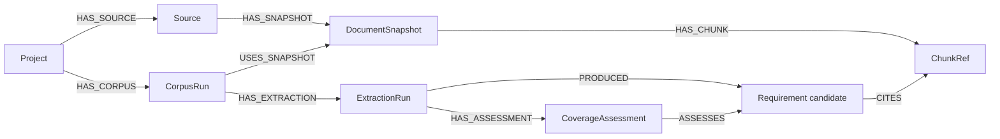

# Graph schema and expansion boundary



All node IDs have uniqueness constraints. Source, snapshot, chunk and requirement identities incorporate the project. A new collection has its own run ID, while identical versioned snapshots and chunks can be reused. Snapshot identity includes the full source configuration (including authority and scope), raw and normalized hashes, and the normalizer version. Older retained runs keep their original identities. The run-to-snapshot relationship records that run's retrieval time. A requirement node ID includes the extraction run and candidate identity, preserving previous validation results. Its `candidate_id` includes content and evidence; semantic revision lineage is a future feature. Model and prompt provenance live on `ExtractionRun`.

The code baseline is the actual deployed commit, including shared compatibility fixes, so future source mappings match the observed website. The original upstream comparison remains in the evaluation manifest. These are separate concepts.

ChunkRef contains chunk identity, heading, content hash, and artifact reference. Full document/chunk text stays in local artifacts and the vector payload. Neo4j retains short exact citation quotes on CITES relationships for traceability.

## Questions supported now

Get a project's candidate requirements and exact supporting sections:

```cypher
MATCH (p:Project {id: $project_id})-[:HAS_CORPUS]->(c)
      -[:HAS_EXTRACTION]->(e:ExtractionRun {id: $extraction_id})
      -[:PRODUCED]->(r:Requirement)-[s:CITES]->(chunk:ChunkRef)
RETURN r.statement, r.validation, chunk.heading, s.quote, chunk.source_id
```

`CITES` stores `quote_verified` and `semantic_verified=false`: even an exact quote does not automatically establish entailment. Rejected candidates retain their claimed citation for audit and are excluded from normal requirement/coverage views.

Find requirements with no browser assessment yet, without calling them absent:

```cypher
MATCH (:Project {id: $project_id})-[:HAS_CORPUS]->()
      -[:HAS_EXTRACTION]->(e:ExtractionRun {id: $extraction_id})
      -[:HAS_ASSESSMENT]->(a:CoverageAssessment)-[:ASSESSES]->(r:Requirement)
WHERE a.status = 'NOT_EVALUATED' AND r.validation <> 'REJECTED'
RETURN r.statement, r.validation, a.reason
```

## Implemented static code graph and impact retrieval

The document graph above remains in place. A separate immutable graph projection now stores
`ImpactSnapshot` nodes and scoped `ImpactEntity` nodes. Each entity has a `kind`
(`CodeFile`, `CodeSymbol`, `UIElement`, `UserFlow`, or `Requirement`). `IMPACT_LINK`
relationships carry a validated `type`, status and evidence properties. Snapshot IDs
and node keys isolate configs/ingestion/revisions without merging this projection into the
existing document requirement nodes.

| Relationship type | Direction and meaning |
| --- | --- |
| DECLARES | File → symbol, with file path, declaration lines and source-text hash on the symbol |
| IMPORTS | Importing file → resolved local module file |
| DEPENDS_ON | Referencing symbol → referenced symbol, or importing module → imported module |
| RENDERS | Symbol → UI element, only when an evidence-backed mapping exists |
| CONTAINS | User flow → UI element |
| CHECKS | User flow → requirement |

`CONFIRMED` means the recorded static reference or supplied mapping was accepted for
this graph. It is not proof of runtime execution or behavioral impact. The real
TypeScript analyzer creates files, symbols and static dependencies. It does not invent
UI elements, flows, or links to ingested requirements.

Three boundaries keep extension simple:

- `CodeAnalyzer.analyze(config)` produces a validated `GraphSnapshot`.
- `GraphReader.lookup(...)` and `neighbors(...)` provide scoped nodes and relationships.
- `ImpactRetriever.retrieve(query)` performs bounded traversal and returns witnesses.

The built-in TypeScript analyzer reads Git blobs at a full commit SHA, excluding dirty
worktree changes. It uses a pinned TypeScript compiler, resolves aliases and local
identifier references, honors tsconfig roots/exclusions, and records unresolved
imports. It never executes repository code or compiler plugins. Register another
analyzer through `app.components.code_analyzers` and select it in JSON. Alternate graph
readers can be injected into `ImpactRetriever` without editing traversal logic.

Publication is one transaction, with node/edge read-back counts, immutable content
checks and idempotent writes. It retains earlier snapshots. Neo4j reads use fixed
parameterized Cypher, scope filters on both ends of every edge, and query timeouts.
Retrieval follows **incoming** dependencies from changed symbols, then confirmed
symbol-to-UI, flow-to-UI and flow-to-requirement links. It deduplicates results and
terminates cycles. Node/edge budget overflow or database failure raises an error;
neither is treated as an empty success. A dependency-hop boundary is reported explicitly.

Results include scoped node metadata, relationship evidence and one valid witness per
returned node. `UNMAPPED` and `UNMAPPED_WITHIN_BUDGET` express uncertainty. Name collisions
produce `AMBIGUOUS_SYMBOL`. Reachable results are **risk candidates**, not confirmed bugs.

### Run it

The TypeScript helper requires Node and its pinned dependency (installed in this workspace):

```powershell
Push-Location src/trace_impact/ingestion/code/typescript
npm ci --ignore-scripts --no-audit --no-fund
Pop-Location
uv run --no-sync trace-impact analyze-code configs/ingestion/saleor/code.json --output artifacts/code/saleor-baseline.json
uv run --no-sync trace-impact publish-code-graph artifacts/code/saleor-baseline.json
uv run --no-sync trace-impact impact 0ee1e79541baa31323dcbe2235403d62 configs/retrieval/saleor-impact.json
```

Use the graph ID printed by analysis/publication after changing configuration or code.
[code.saleor.json](../configs/ingestion/saleor/code.json) selects the repository, deployed baseline
commit and analyzer options. Its repository path is relative to the JSON file; set it
to your own checkout when moving the project. [impact.saleor.json](../configs/retrieval/saleor-impact.json)
selects changed files, project, revision and dependency-hop budget. You can instead supply
exact `changed_symbol_ids` or a `symbol_lookup` name, using only one lookup mode at a time.
The retrieval input is changed code, not an LLM-generated Cypher query.

Regenerate editor definitions with `trace-impact code-schema` and
`trace-impact impact-schema`. Python callers can use `app.analyze_code(path)`,
`app.publish_code_graph(snapshot)` and `app.retrieve_impact(graph_id, query)`.

### Measured results and remaining gaps

The final real Saleor snapshot contains **244 files, 1,857 symbols and 5,365 relationships**
at deployed baseline `6e55bd8b924c0341e21a85d4666ca510838ed4e5`. The analysis initially included
reference files; honoring the tsconfig exclusion removed them before final publication.
The PR's two changed files returned **43 potentially affected symbols in seven files**
from real Neo4j in approximately **0.93 seconds** in one observed query. This is not a
latency distribution or measured impact precision.

There are 338 diagnostics, including 41 unresolved relative/alias import occurrences
involving generated GraphQL modules and CSS. External packages, generated files absent
from Git, computed dynamic imports, reflection, and complete runtime/framework behavior
are outside this analyzer. It extracts supported declarations/references, not every
possible dependency. Source properties refer to the analyzed decoded text; line numbers
are one-based. No real UI/flow mappings exist yet, so the Saleor result is `UNMAPPED`.

Separately, **20 frozen synthetic graph cases passed against real Neo4j**. UI, flow and
requirement sets each scored 100% precision and recall, with zero status mismatches.
Returned witness paths were checked for direction, scope, confirmed status and hop limits.
This validates the synthetic traversal contract, not Saleor impact accuracy or extraction
completeness. Labels remain draft and the five combined graph-plus-vector cases remain
unexecuted. See [experiment history](retrieval-experiment-history.md).

### Remaining three-layer mapping

Browser discovery still needs `CrawlRun`, `ScreenState` and `Transition` evidence, plus real UI/flow mappings. A crawl creates its own coverage assessments. Candidate links from a requirement to UI behavior or from UI to code need evidence, mapping method, uncertainty reasons, and run context. Similar names are candidate matches, not confirmed relationships.

The impact query should start at changed code symbols/files in a known baseline, traverse justified mappings to UI elements and discovered flows, then find the requirements and assessments they support. An unmapped symbol must produce an uncertainty entry rather than an invented link. Changed code indicates risk; loss of coverage or behavior needs separate evidence.
