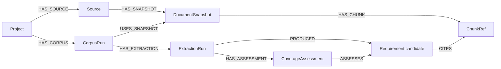

# Graph schema and expansion boundary



All node IDs have uniqueness constraints. Source, snapshot, chunk and requirement identities incorporate the project. A new collection has its own run ID, while identical versioned snapshots and chunks can be reused. Snapshot identity includes the full source configuration (including authority and scope), raw and normalized hashes, and the normalizer version. Older retained runs keep their original identities. The run-to-snapshot relationship records that run's retrieval time. A requirement node ID includes the extraction run and candidate identity, preserving previous validation results. Its `candidate_id` includes content and evidence; semantic revision lineage is a future feature. Model and prompt provenance live on `ExtractionRun`.

The code baseline is the actual deployed commit, including shared compatibility fixes, so future source mappings match the observed website. The original upstream comparison remains in the evaluation manifest. These are separate concepts.

ChunkRef contains chunk identity, heading, content hash, and artifact reference. Full document/chunk text stays in local artifacts and the vector payload. Neo4j retains short exact citation quotes on CITES relationships for traceability.

## Questions supported now

Get a project's candidate requirements and exact supporting sections:

```cypher
MATCH (p:Project {id: $project_id})-[:HAS_CORPUS]->(c)
      -[:HAS_EXTRACTION]->(e:ExtractionRun {id: $extraction_id})
      -[:PRODUCED]->(r:Requirement)-[s:CITES]->(chunk:ChunkRef)
RETURN r.statement, r.validation, chunk.heading, s.quote, chunk.source_id
```

`CITES` stores `quote_verified` and `semantic_verified=false`: even an exact quote does not automatically establish entailment. Rejected candidates retain their claimed citation for audit and are excluded from normal requirement/coverage views.

Find requirements with no browser assessment yet, without calling them absent:

```cypher
MATCH (:Project {id: $project_id})-[:HAS_CORPUS]->()
      -[:HAS_EXTRACTION]->(e:ExtractionRun {id: $extraction_id})
      -[:HAS_ASSESSMENT]->(a:CoverageAssessment)-[:ASSESSES]->(r:Requirement)
WHERE a.status = 'NOT_EVALUATED' AND r.validation <> 'REJECTED'
RETURN r.statement, r.validation, a.reason
```

## Future three-layer mapping (not implemented)

Add `CrawlRun`, `ScreenState`, `UIElement`, `Transition`, `UserFlow`, `RepositoryRevision`, `CodeFile`, and `CodeSymbol` with observed evidence and revision IDs. A crawl creates its own coverage assessments. Candidate links from a requirement to UI behavior or from UI to code need evidence, mapping method, uncertainty reasons, and run context. Similar names are candidate matches, not confirmed relationships.

The impact query should start at changed code symbols/files in a known baseline, traverse justified mappings to UI elements and discovered flows, then find the requirements and assessments they support. An unmapped symbol must produce an uncertainty entry rather than an invented link. Changed code indicates risk; loss of coverage or behavior needs separate evidence.
