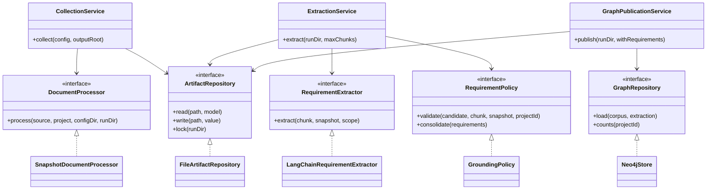

# Ingestion low-level design

Status: implemented architecture for a single-host CLI application. This is not yet a production-certified service: live model/Neo4j verification, deployment operations, load testing, and full assignment evaluation remain open.

## 1. Purpose and boundaries

Given a project manifest containing explicit public documentation sources, create reproducible document snapshots, extract atomic requirement candidates, verify their citations, and publish auditable evidence to Neo4j. Saleor is configuration, not a subclass or conditional in the application.

Keep the assignment's four capabilities distinct: autonomous UI exploration, requirements ingestion, requirement/UI/code graph mapping, and real-PR impact reporting. This module implements the ingestion path. Manual reference requirements and patched/PR evidence remain outside its input corpus. Browser observations, source-code mappings, and impact analysis will be separate use cases sharing versioned domain contracts.

## 2. Dependency direction

```text
CLI -> ApplicationContainer -> application services -> application ports + domain
                                  ^                         ^
                                  |                         |
                           injected adapters implement these ports

domain/          Models, evidence rules, safe boundary errors
application/     Ports, use cases, versioned extraction prompt
infrastructure/  HTTP/files, parsers, LangChain, artifact persistence, Neo4j, logging
bootstrap.py     Construction and resource lifetime
settings.py      Validated runtime settings and masked secrets
cli.py           Arguments, exit codes, JSON output
```

Domain and application modules cannot import infrastructure, HTTP clients, LangChain, OpenAI, or Neo4j. An architecture test enforces that direction. Constructor injection lets tests and future entry points supply different adapters without patching service internals.

## 3. Class design



Ports are Python `Protocol` contracts, not runtime inheritance requirements. Service dependencies are explicit objects. Pure normalization and identity functions remain functions because they do not own resources or state.

| Class | Owned responsibility | Important method/contract |
|---|---|---|
| `ApplicationContainer` | Construct collaborators and close HTTP/database resources | Context manager; `collection()`, `extraction()`, `database()`, `publication()` |
| `CollectionService` | Coordinate each configured source and checkpoint progress | `collect(Path, Path) -> (Path, Corpus)` |
| `SourceReaderRegistry` | Select a reader by explicitly supported URI scheme | HTTPS or project-local file; unsupported schemes fail |
| `HttpSourceReader` | Bounded remote reads; validate each redirect | Injected HTTP client, 30-second request timeout, six redirect iterations, 5 MB limit |
| `LocalFileReader` | Read files within the configured project directory | Resolve path and reject escapes |
| `SnapshotDocumentProcessor` | Read, normalize, retain raw/text evidence, create chunks | Implements `DocumentProcessor`; expected input/network errors become `SourceReadError` |
| `ExtractionService` | Budget, cache, checkpoint, validate, consolidate | Refuses incomplete collection; complete only after every chunk succeeds |
| `LangChainRequirementExtractor` | Structured LLM boundary | Injected Runnable; refusal/truncation/parse checks; no evidence-policy decisions |
| `GroundingPolicy` | Deterministic citation/authority validation and exact deduplication | Replaceable validation strategy |
| `FileArtifactRepository` | Typed reads, atomic JSON writes, exclusive run lock | Read corruption fails explicitly; never silently re-bills a cached call |
| `GraphPublicationService` | Read coherent run artifacts and publish | Uses the same run lock as extraction |
| `Neo4jStore` | Constraints and parameterized managed transactions | Idempotent reload; reject partial/mismatched extraction |
| `JsonEventSink` | Structured progress and usage events | IDs/counts/statuses to stderr; no prompts, secrets, or raw exception bodies |
| `Settings` | Validated deployment configuration | Frozen Pydantic model; secret representations are masked |

## 4. Patterns and reasons

| Pattern | Concrete use | Why it is useful here |
|---|---|---|
| Ports and adapters | Application contracts separated from IO implementations | Change database/model/document adapter without rewriting workflows |
| Strategy | Readers and grounding policy | Choose behavior through composition rather than Saleor-specific conditionals |
| Adapter | LangChain and Neo4j implementations | Vendor APIs stay outside the domain |
| Repository | Artifact and graph ports | Persistence and transactions can be replaced and tested independently |
| Composition root / constructor injection | `ApplicationContainer` | One visible place to select implementations and own clients |
| Application service | Collection, extraction, publication classes | Each use case has one entry point and one orchestration responsibility |
| Compatibility facade | Existing top-level modules | Existing scripts/tests can migrate without immediately breaking imports |

No singleton, global service locator, generic agent hierarchy, or dependency injection framework is needed for the current lifecycle. Adding classes without ownership or substitution value would obscure the flow.

## 5. Why and where LangChain is used

The production model path is `ChatOpenAI.with_structured_output(Extraction, method="json_schema", strict=True, include_raw=True)`, wrapped by `LangChainRequirementExtractor`. It uses the Responses API, explicit model selection, a 6,000-output-token cap by default, a request timeout, and two SDK retries. The original direct-SDK extractor is removed.

The returned Pydantic object is still a candidate. `GroundingPolicy` checks quoted evidence and source authority independently. A valid JSON schema does not establish truth. Missing/invalid parsed output, refusal, and truncated responses cannot become successful extractions.

LangChain's [ChatOpenAI integration](https://docs.langchain.com/oss/python/integrations/chat/openai) documents structured output and model integration. This project uses its focused provider/core packages, without an autonomous agent loop for document extraction. LangGraph is not needed for this sequential workflow. RAG/vector retrieval remains a later, evidence-driven choice; collecting 121 explicit chunks does not itself require a vector database.

Only OpenAI is wired into the CLI today. For another provider, supply a structured Runnable and implement the provider-specific error/metadata handling behind `RequirementExtractor`; add contract tests and register it in the composition root. The current adapter does not claim every vendor's errors or schema capabilities are interchangeable.

LangSmith tracing is explicitly disabled around model invocation, and `store=False` is sent to the OpenAI Responses API. Neither setting is a blanket assertion about a provider's retention policy. Token counts are emitted when returned by the provider; cost estimation and hard monetary budgets are not implemented.

## 6. Runtime sequence

1. CLI parses arguments, loads the local environment, validates `Settings`, and enters `ApplicationContainer`.
2. Collection loads the `Project` contract through the artifact repository and creates a unique `Corpus` run.
3. The processor reads only configured sources, normalizes main content, records raw/text hashes and source semantics, and splits Markdown by section/block boundaries.
4. The service checkpoints each source result and writes an inventory. Expected source failures are explicit; unexpected programming/storage failures abort.
5. Extraction locks the run, checks the manifest against collected sources, and creates a `PARTIAL` extraction checkpoint before model work.
6. For each bounded chunk, it computes the cache identity. Valid cached model output is reused; otherwise LangChain is called. Empty output needs an explanation.
7. Domain validation happens before the chunk is marked processed. Exact duplicates are consolidated while keeping evidence. Ambiguous/inferred candidates enter review.
8. After all chunks succeed, the extraction becomes `COMPLETE`. Otherwise it remains `PARTIAL` and CLI exits nonzero.
9. Graph publication locks and reads the artifacts, validates consistency, and sends one managed transaction for the intended small corpus. Client resources close on exit.

## 7. State, identity, and recovery

| Concern | Implemented behavior |
|---|---|
| Interrupted collection | Source manifest completeness is verified before extraction/publication, even if interruption happened before an error record |
| Collection recovery | Recollect into a new run; per-source resume is not implemented |
| Model failure | Chunk remains failed; successful chunks stay cached; rerun retries failures |
| Extraction budget | `max_chunks` limits the ordered prefix processed in that invocation, including cache hits; increase the limit to complete the same run |
| Retry boundary | SDK handles up to two transient retries per model call; no nested application retry loop |
| Corrupt cache | Stop with `ARTIFACT_INVALID`; preserve the file for inspection instead of silently replacing/re-billing |
| Atomic writes | Unique temporary file, flush, fsync, atomic replace; failed replacement preserves prior checkpoint |
| Overlapping processes | OS-backed exclusive file lock; competing extractor/publisher fails with `RUN_BUSY` |
| Unexpected failure | Propagates and fails the command; previously written checkpoints remain |
| Snapshot identity | Includes project, complete source configuration, normalizer version, raw and normalized hashes |
| Cache identity | Adapter/model/prompt/schema/configuration fingerprint + project configuration hash + chunk identity |
| Extraction history | Each invocation has its own immutable ID and checkpoint file; `extraction.json` points to the latest artifact contents |
| Graph audit | Requirement observations are scoped to an extraction run; `candidate_id` retains content/evidence identity |
| Publication retry | Neo4j managed transaction plus `MERGE` IDs makes reloading the same run idempotent |

The filesystem checkpoint and graph transaction are separate persistence operations, not a distributed transaction. If Neo4j commits but the CLI loses its response, re-publishing the same extraction is safe. Directory metadata durability across power loss, network-filesystem locks, multiple hosts, and parallel chunk workers are outside the validated operating envelope.

## 8. Evidence and assignment invariants

- Documents are untrusted input, never executable instructions.
- Every candidate retains an exact source quote and chunk identity.
- `GROUNDED_CANDIDATE` means citation presence, not semantic entailment or confirmed UI implementation.
- A backend/API capability cannot independently establish a storefront requirement.
- New graph coverage is `NOT_EVALUATED`; an unseen control is never automatically called missing.
- Source baseline, browser baseline, and later PR comparison revisions must remain explicit.
- Manual reference requirements, patched observations, and PR descriptions do not leak into baseline extraction.
- A project ID provides logical separation, not tenant access control.

## 9. Extension walkthrough

For a second public HTML/Markdown repository, create a manifest under `projects/<id>/`, pin the deployed baseline, configure sources/hosts/scope/authority, and use the same CLI. No service code changes are needed.

For a different source type such as an authenticated wiki or PDF, implement a reader/processor adapter and inject it through `ApplicationContainer.collection()`. Keep credential handling inside that adapter. Add representative parsing and failure tests before registering the source.

For object storage, implement `ArtifactRepository`; its lock must provide equivalent exclusivity across the intended deployment topology. A plain S3 upload is not a substitute for the lock contract. For another graph database, implement `GraphRepository` with equivalent publication validation and idempotency.

For future browser and code stages, add their own ports, services, and evidence models. Reuse project/run identity and provenance conventions; do not place browser actions inside `ExtractionService`.

## 10. Production release gates

Completed now: explicit dependencies, documented class ownership, typed data contracts, bounded input reads, model timeouts/retries, output validation, run isolation, atomic checkpoints, resume cache, structured events, secrets excluded from version control, and automated regression checks.

Still required before a production claim:

1. Real model extraction quality evaluation and Neo4j integration tests against the configured instance.
2. Live idempotency, database outage/recovery, deployment smoke tests, and backup/restore rehearsal.
3. Representative large-corpus load tests; database batching and memory/cost limits based on measured use.
4. Authentication/authorization, tenant isolation, secret rotation, and egress controls before accepting untrusted project configurations in a service.
5. Metrics aggregation, alerts, retention policies, distributed locking/queueing if running across hosts, and SLOs.
6. Semantic requirement evaluation, human review workflow, UI/code mapping evaluation, and complete assignment deliverables.

## 11. Reading and debugging in PyCharm

Read `projects/saleor/project.json`, then `domain/models.py`, `application/ports.py`, `bootstrap.py`, and `application/services.py`. Follow one injected adapter at a time after that.

Set a breakpoint in `CollectionService.collect`. Run Python module `trace_impact.cli` with parameters `collect projects/example/project.json`, working directory at the repository root, and the existing `.venv` interpreter. The synthetic example exercises the same path without network/model/database credentials. The actual Saleor manifest then exercises the public HTTP readers.

The former `models.py`, `documents.py`, `extraction.py`, `pipeline.py`, and `graph.py` at package root are compatibility facades. New implementation belongs in the layer directories; facades do not define a second architecture.
