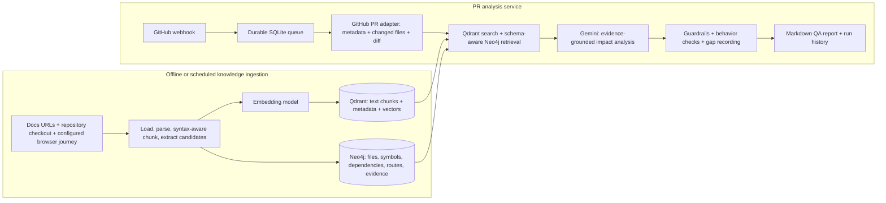
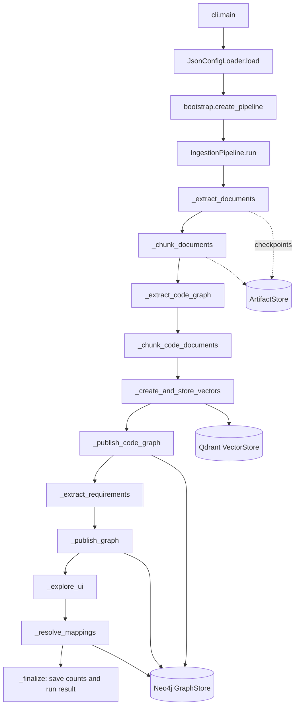
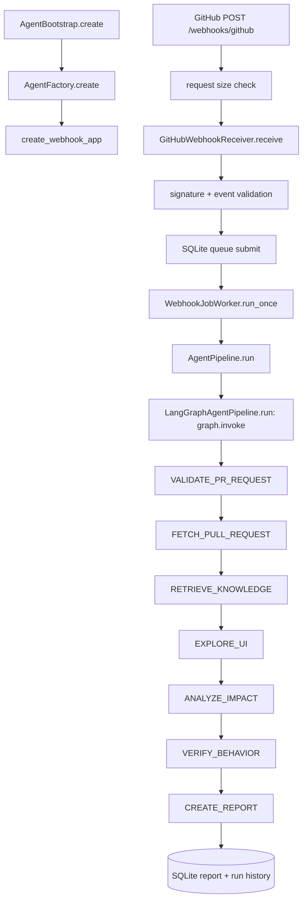
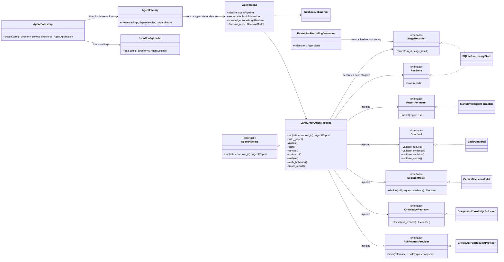
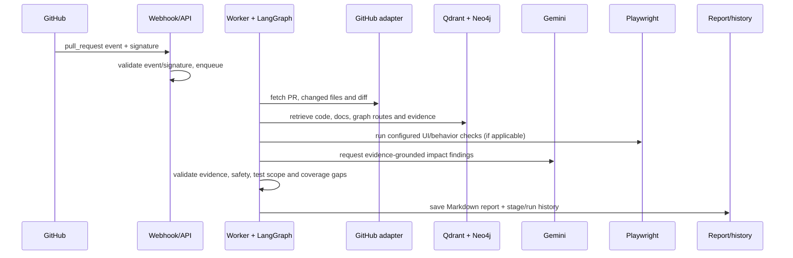

# PRAgent — Architecture and Design

## 1. Executive summary

This project builds a knowledge-backed assistant that helps QA and engineering teams understand the likely customer impact of a pull request. It gathers product documentation, source-code structure and selected browser observations into Qdrant and Neo4j. When a PR arrives, a webhook queues work; the worker loads the PR and diff, retrieves relevant evidence, asks a configured model to explain likely impacts, applies safety checks and saves a readable report.

The central design decision is to keep **searchable text** and **explicit relationships** in stores suited to each job. Qdrant holds embedded code/document chunks for semantic search. Neo4j holds source files, symbols, dependencies, requirements/citations, observed routes and evidence-backed mappings. A browser observation or graph edge is evidence of a relationship; a semantic similarity score alone is not.

A live run against the sample storefront PR #1 completed as `COMPLETED_WITH_GAPS`. It exercised GitHub, Gemini, Neo4j, Qdrant and configured Playwright checks. The browser checks confirmed the checkout address and control presence only. They did not apply/remove a voucher or validate updated totals. This is a prototype, not a claim that a complete autonomous application crawler or exhaustive functional coverage is finished.

## 2. Problem and users

A reviewer sees changed files and often cannot tell which product areas, screens, user journeys or tests may be affected. QA then has to rediscover dependencies and decide what to retest. The agent should turn a PR into a traceable impact summary:

- what code changed;
- which requirements, components, routes and user journeys have evidence-backed relationships to that code;
- what likely user-visible behavior could change;
- which checks actually ran and passed;
- what remains unknown and should be reviewed by a person.

The main reader is a QA engineer or product-minded reviewer, so the report should use clear language, point to evidence and distinguish an impact prediction from an executed test result.

## 3. Scope and explicit decisions

### In scope in the current prototype

- A GitHub webhook receiver validates requests and places work on a durable SQLite queue.
- A worker fetches PR metadata/files/diff through a GitHub adapter.
- Retrieval combines Qdrant semantic results and schema-aware Neo4j code-graph results.
- Gemini plans bounded graph retrieval and creates impact findings from evidence.
- Guardrails validate request/evidence/decision/output and preserve gaps.
- Optional Playwright browser exploration and behavior checks run using configured adapters/scenarios.
- Markdown reports and run/stage history are persisted locally.
- Offline tests cover the components; one live PR run is retained with a draft quality evaluation.

### Not claimed as complete

- The browser does not autonomously crawl the full application, choose arbitrary actions or generate a complete screen-transition graph. Ingestion uses configured seed paths and a scripted checkout journey.
- Current browser output is not a complete DOM/screenshot/control graph. Route-to-code links are stronger than exact control-to-code links; requirement-to-UI/code coverage is incomplete.
- The voucher scenario was a presence/URL smoke test, not functional voucher testing.
- A single LLM-judge evaluation case is not a benchmark and its labels are awaiting human review.
- Production deployment, webhook operations, security review, concurrency/load testing and organization-wide privacy controls are not demonstrated by this local prototype.

These boundaries are represented as coverage gaps in reports instead of being silently inferred as success.

## 4. High-level architecture

This diagram shows the two-part flow: ingestion builds reusable project knowledge, and PRAgent analyzes one pull request against that knowledge.




Ingestion and analysis have independent configurations and dependencies. The ingestion command can refresh the code/UI graph without embedding or LLM calls using `--code-ui-only`. The analysis process reads the shared local Qdrant store and configured Neo4j database.

### Code-level flow: ingestion

The executable entry point is `ingestion/src/ingestion/cli.py:main`. It loads the selected JSON using `JsonConfigLoader`, then calls a factory in `ingestion/src/ingestion/bootstrap.py` to construct the concrete adapters. The `IngestionPipeline` receives these dependencies through its constructor; it does not create providers or databases inside the stage methods.

The diagram below gives the wider implementation view: configuration and bean wiring, separate document/code/UI extraction branches, Qdrant and Neo4j publication, checkpoints, and stage evaluation. The [editable Excalidraw source](ingestion-code-flow.excalidraw) is included alongside this document.




Each stage is decorated with `record_stage`, which sends a stage observation to the injected recorder while leaving the work in the pipeline method. Ingestion also saves checkpoints and failure details through `ArtifactStore`, which supports recovery after embedding. The `--code-ui-only` mode uses a separate refresh path and deliberately avoids document extraction, embeddings and Qdrant writes.

### Code-level flow: PR agent

Startup begins in `agents/src/impact_agent/dependencies/agent_bootstrap.py:AgentBootstrap.create`. The bootstrap loads and validates separate JSON settings, creates provider adapters and resources, then `AgentFactory.create` injects implementations behind interfaces. The returned `AgentApplication` exposes the webhook app and worker.

The code-design diagram gives the end-to-end view from startup wiring through webhook receipt and LangGraph stages, then groups the replaceable interfaces with their implementations. The [editable Excalidraw source](code-design.excalidraw) is included alongside this document.




The graph is built once in `LangGraphAgentPipeline._build_graph`. Each node is wrapped by `_record`, which applies `EvaluationRecordingDecorator` to the stage. `_retrieve` combines the injected knowledge retriever with bounded, hash-addressed PR diff evidence; `_analyze` passes validated evidence to the decision model; `_verify_behavior` records check results and any gaps; `_create_report` selects `COMPLETED` or `COMPLETED_WITH_GAPS`, validates rendered output and persists it.

### Code design: interfaces and patterns

The class view below complements the code-design diagram with the concrete contracts and dependencies. Interfaces are small `Protocol` ports; concrete providers can be replaced without changing the LangGraph coordinator.



The code uses a small set of practical patterns:

- **Ports and adapters (dependency inversion):** `Protocol` interfaces such as `PullRequestProvider`, `KnowledgeRetriever` and `DecisionModel` define application needs. GitHub, Qdrant/Neo4j and Gemini implementations sit behind those ports, so the coordinator depends on behavior rather than vendor SDKs.
- **Dependency injection and composition root:** `AgentBootstrap.create()` loads settings and resources; `AgentFactory.create()` assembles typed `AgentBeans`. Services receive dependencies through constructors, and tests can supply fakes.
- **Adapter:** provider classes translate GitHub, model, database and Playwright APIs into application domain types.
- **Decorator:** `EvaluationRecordingDecorator` wraps each LangGraph stage and records duration, status and SHA-256 input/output fingerprints. It does not persist full state, and recorder errors do not change analysis behavior.
- **State graph:** `LangGraphAgentPipeline` owns the visible stage order and typed `AgentState`; `PipelineNode` and `EvaluationStage` enums avoid scattered stage-name strings.
- **Composition:** `CompositeKnowledgeRetriever` combines available retrievers behind one `KnowledgeRetriever` interface.

These focused patterns support substitution and testing without a framework-heavy container. The bootstrap and graph keep runtime wiring and stage order visible.

### Why two stores?

Qdrant answers “which text chunks are semantically related to this PR/query?” Neo4j answers “what known, typed relationships connect these symbols, files and routes?” A vector match is a candidate source of context; it does not establish a dependency edge. Graph relationships include `IMPORTS`, `DECLARES`, `CALLS`, `RENDERS`, `EXTENDS`, `IMPLEMENTS`, route declarations and evidence-backed `AFFECTS_UI` mapping.

## 5. Main PR flow



The current graph stages are `VALIDATE_PR_REQUEST → FETCH_PULL_REQUEST → RETRIEVE_KNOWLEDGE → EXPLORE_UI → ANALYZE_IMPACT → VERIFY_BEHAVIOR → CREATE_REPORT`. Each stage is wrapped by an evaluation recorder decorator, so stage input/output summaries can be captured without inserting evaluation-specific code into every stage. The decorator records; it does not itself prove quality.

### Runtime details

1. **Receive:** FastAPI validates the GitHub webhook signature/event and persists a job in SQLite. The worker can resume queued jobs after service restart.
2. **Load PR:** The GitHub adapter obtains metadata, changed paths and bounded diff text. Diff evidence is hashed and truncated within configuration budgets.
3. **Retrieve:** Qdrant returns text/code chunks; Neo4j retrieval reads the graph schema, requests bounded parameterized Cypher from the configured model, validates required PR/revision parameters and executes in a read-mode, time-bounded transaction. Database credentials should independently be read-only.
4. **Explore:** Optional browser capture and configured assertions contribute browser evidence. An unavailable adapter or a smoke-only scenario creates a gap rather than a false functional PASS.
5. **Analyze:** The decision model receives the PR and validated evidence. Findings must cite evidence IDs. Direct PR diff evidence is included when it is available.
6. **Guard:** Guardrails validate requests, retrieved evidence, model findings and rendered output. Unsupported claims or unsafe evidence are rejected/marked, and gaps are carried forward.
7. **Report:** The report status is `COMPLETED` only when required stages have no known gaps; otherwise it is `COMPLETED_WITH_GAPS`. The run and report are stored in SQLite.

### Presentation walkthrough: real PR, agent comment, and saved evaluation

Use the public [sample PR #1](https://github.com/Maniteja-ai/storefront/pull/1) as the live screen. Its title is “Fix checkout promo code redemption (#1199).” Start with the PR description and **Files changed** tab: the PR replaces the local-only `saleor10` placeholder with Saleor `checkoutAddPromoCode` / `checkoutRemovePromoCode` mutations, handles errors and loading state, and refreshes checkout data for desktop and mobile summaries. The PR description also lists the repository checks that were run (type check, lint, build, and diff check). Those are code/repository checks; they are not the same as the agent's browser behavior checks.

Next open the existing [agent bot comment on PR #1](https://github.com/Maniteja-ai/storefront/pull/1#issuecomment-5967119739). Use it to show how the agent's answer reads like a concise review: likely impact, evidence references, proposed verification, limitations, and tool-call counts. The comment says behavior verification was disabled and its proposed voucher checks were **not run**. It is a real comment already on the PR; this walkthrough does not create or post another comment.

Then open the [saved detailed report](../../agents/evaluation/agent_quality/snapshots/2026-10-05-saleor-pr-1/report.md) and its [evaluation summary](../../agents/evaluation/agent_quality/snapshots/2026-10-05-saleor-pr-1/summary.md). These are a separate local run, `live-e2e-pr1-scope-gap-20261005`, so explain the difference instead of presenting them as the exact same execution as the GitHub bot comment:

- The saved run is `COMPLETED_WITH_GAPS`. Its configured browser assertions passed for the checkout URL, discount-code input, and Apply button visibility.
- It did **not** submit a valid or invalid voucher, remove an applied voucher, or verify totals. The report explicitly leaves those business outcomes unverified.
- The one-case LLM judge reported 100% precision, recall, and faithfulness, but the labels are draft and pending human review. Evidence relevance was 56.2%. Treat these as diagnostic results, not a benchmark or proof of production quality.

**Suggested narration:** “The PR description shows the change and its code checks. The bot comment is the short, review-style impact summary and clearly marks behavior as unverified. The local report gives the detailed evidence and the exact browser assertions. It only confirmed that checkout and the controls were visible; it did not test voucher redemption or totals. The evaluation is one draft case, so we use it to demonstrate the evaluation path, not claim a reliable score.”

For a clean presentation, show the GitHub PR first, open the bot-comment link, then switch to the saved local report and summary. The browser screenshots in the presentation are visual aids; the links above are the source of truth for the PR and stored run artifacts.

## 6. Knowledge ingestion and data model

### Configured inputs

The Saleor project config is split into a root manifest and six readable files: `input.json`, `models.json`, `chunking.json`, `storage.json`, `constraints.json`, and `evaluation.json`. Input config pins the storefront baseline and code roots; selects nine public docs/API sources; configures an HTTPS baseline URL, seed paths and a scripted product-to-checkout journey. Model config selects Gemini embedding (`gemini-embedding-2`), requirement extraction (`gemini-3.5-flash-lite`) and evaluation judge (`gemini-2.5-flash`). Chunking uses section-aware document chunking and syntax-aware code chunking with a maximum chunk size. Storage selects local artifacts, Neo4j and Qdrant with cosine similarity. Constraints bound retries, timeouts, documents/files/pages and source failure policy. Evaluation config controls recorder output and dataset/metrics.

Credentials are environment variables, not JSON. Exact repository revisions and artifact hashes support reproducibility. Current online documentation URLs are labeled unpinned; their version compatibility with the historical baseline remains a limitation.

### Qdrant

Stores embedded text chunks for documentation and code. Payload metadata includes source/repository identity, revision, file path, symbol or section information, line range and related tags. Code extraction is syntax-aware and produces function/method/component/class-context chunks where the parser can identify symbols. Embeddings make content discoverable even when the query uses different wording.

### Neo4j

Stores typed entities and relationships: source files, code symbols, requirements/candidates, source documents/chunks/citations, browser observations, routes and code/UI mappings. Code dependencies are parsed statically where possible. A route link is considered confirmed only when a supported framework route, a configured browser observation or explicit code tag provides evidence. The Saleor refresh had 268 code files, 596 import relationships, four browser observations and four evidence-backed route mappings. This is not proof that every visible control or requirement is mapped.

Requirement extraction currently produces cited candidates, and artifacts record evidence. Semantic entailment and frontend scope still need human review; the earlier document run reported 62 grounded candidates but all 96 assessments remained `NOT_EVALUATED`. Do not interpret “quote found” as “requirement confirmed.”

## 7. Confidence, ambiguity and human review

Evidence should carry a source, revision/content hash, location and relationship basis. Report claims use evidence IDs; the PR diff is primary for what changed. Documentation is useful for API expectations but may not match a historical app baseline when unpinned. Static imports indicate reachability, not necessarily runtime visibility. Browser presence checks prove only presence at the captured state.

A practical confidence policy is:

- **High:** directly changed code or a deterministic graph edge with matching revision and source location; phrase as “the change does…”
- **Medium:** multiple compatible graph/vector/doc signals but no direct runtime assertion; phrase as “may affect” and name the basis.
- **Low/unknown:** candidate mapping, missing route, stale revision, conflicting sources or unavailable browser state; report a coverage gap and request human review.

The current implementation validates evidence and rejects/quarantines unsafe or unsupported cases, but it does not yet provide a fully calibrated statistical confidence model. The sample case’s dataset is marked `DRAFT_PENDING_HUMAN_REVIEW`; scores should not gate releases. A human should review graph mappings, expected-impact labels, findings with low/ambiguous evidence and any gap affecting a critical flow.

## 8. Safety and privacy controls

- Webhook signature validation, event allowlisting, request-size limits and a durable queue protect the entry boundary.
- Graph retrieval is parameterized, row/time bounded and intended for a least-privilege read-only Neo4j identity.
- Browser navigation is constrained by HTTPS host allowlists and configured action/time limits.
- Model evidence is validated. The current `BasicGuardrail` uses deterministic code checks and configured regular-expression patterns for selected instruction-like text and sensitive values. It does **not** call a separate LLM guardrail or a comprehensive DLP/PII service.
- Output is checked before persistence. Run history and stage recording are local SQLite/JSON artifacts in the configured environment.
- Secrets remain in environment variables and ignored `.env` files; never paste PEM/private keys into reports, prompts or commits.

The deterministic guardrail is used because its decisions are easier to reproduce and audit and it adds no extra model call. Its patterns cannot detect every semantic injection or sensitive-data form. An independent LLM classifier could be added as a second signal, but it would add latency/cost and must not replace deterministic policy, evidence validation, permissions or specialized PII scanning. Before production, add organization-grade DLP/PII coverage for all persisted artifacts and logs, retention/deletion controls, encrypted managed storage, key rotation, webhook replay protection, worker authentication and operational alerting. Current controls are prototype safeguards, not a compliance certification.

## 9. Evaluation and repeatability

### What exists

- Offline unit/component tests: **87 agent tests** and **28 ingestion tests** passed on 5 October 2026.
- A saved live PR run: `live-e2e-pr1-scope-gap-20261005`.
- A PR-impact quality dataset with one draft case and a Gemini judge evaluating expected-impact coverage, atomic-claim support, relevance, evidence relevance and test-scope honesty.
- An ingestion retrieval dataset `saleor-retrieval-v0.1` with manifests, input/label/review/schema directories. It is a draft; mapping precision/recall and requirement grounding are not enabled in the current config.

The live PR evaluation reported precision 100%, recall 100%, F1 100%, faithfulness 100%, claim relevance 100%, and evidence relevance 56.2%. It matched six report claims to three expected impacts in one case. Those 100% scores are not statistically meaningful: one draft case and one LLM judge request cannot establish general quality. Evidence relevance at 56.2% is an explicit retrieval-quality issue.

### Retrieval and reranking experiments

We tested whether reranking the vector candidates would improve evidence quality. This work lives in the **ingestion retrieval library** (`ingestion/src/trace_impact/retrieval/`) and its experiment history; it is not currently an enabled reranking stage inside the PR agent's `CompositeKnowledgeRetriever`. The PR agent currently combines Qdrant results and Neo4j graph evidence, then sends the bounded evidence to the impact model. The shared design separates these facts so a reader does not assume a reranker participated in the saved PR run.

On the frozen development set, dense vector search achieved **82.86% Precision@1**. A Gemini reranker re-ordered the same ten candidates for each of 40 questions. It raised Precision@1 to **97.14%**, and the evidence selector achieved **97.78% selected-set precision** and **100% required-evidence recall** under the draft labels. It used 40 model requests, reported 69,465 input and 10,732 output tokens, and averaged 11.74 seconds including the five-requests-per-minute pacing delay; token cost was not measured.

We also tested the local `cross-encoder/ms-marco-MiniLM-L6-v2` on the same saved candidates and 40 questions. It reached **77.14% Precision@1**, **53.45% selected-set precision**, and **75.71% required-evidence recall**; six answerable cases got an incorrect empty selection. Warm reranking averaged 0.433 seconds per query on the test CPU, with 8.58 seconds for first model construction (weights already downloaded). Therefore the cross-encoder was kept as an optional implementation, and reranking remains optional; the default stays vector retrieval for cost/simplicity. A cross-encoder is not automatically better simply because it jointly scores query and passage.

These comparisons reuse draft development labels, not an independent held-out set. They support a configuration decision for this corpus, not a universal claim that Gemini or MiniLM is best. Full methods, run artifacts, thresholds and failures are in [`ingestion/docs/retrieval-experiment-history.md`](../../ingestion/docs/retrieval-experiment-history.md). The separate retrieval library's reranker experiments should not be conflated with the single live PR-agent run.

### Reproduce

From `agents/`:

```powershell
uv run python evaluation/agent_quality/run_quality_eval.py --run-id live-e2e-pr1-scope-gap-20261005
```

This re-evaluates a saved run and makes one configured judge call; it does not repeat PR ingestion, graph retrieval, browser checks or code indexing. The dataset needs independent human review before score interpretation. For stable evaluation, expand it with independently reviewed PRs, measure multiple cases, compare against human labels and report per-category confidence/variance. Add deterministic checks for citations, hashes, stage completion and browser assertion wording. Keep development/test data out of production code paths.

## 10. Trade-offs

- **Webhook plus worker instead of a local-only command:** supports realistic PR arrival and survives transient process restarts; adds queue and deployment operations.
- **Qdrant plus Neo4j:** combines fuzzy semantic search with explainable dependency traversal; requires synchronized revisions and explicit provenance.
- **LLM-generated Cypher:** adapts to graph schema and PR context; it is bounded and validated but adds latency/cost and needs adversarial query testing. Deterministic graph queries remain preferable for well-known retrieval patterns.
- **Scripted browser actions first:** repeatable and bounded; less broad than autonomous exploration. This is a conscious prototype boundary, not completion of the assignment’s autonomous crawler requirement.
- **Persisted run artifacts:** support audit and demos; need retention, privacy and size policies before organizational deployment.

## 11. Three priorities for next week

1. **Complete evidence-backed UI coverage:** build a bounded autonomous crawler that captures screenshots, DOM/control identifiers and transitions; connect observed controls and routes to code through explicit evidence; evaluate mapping precision/recall with independently labeled pages.
2. **Make end-to-end behavior checks meaningful:** seed a deterministic checkout, apply a valid and invalid voucher, remove it, and assert error state and totals on desktop/mobile. Bind assertions to graph routes and changed PR code; record environment and test artifacts.
3. **Turn draft evaluations into a release signal:** add a broader independently reviewed PR and retrieval dataset, score grounding/precision/recall/faithfulness/relevance over multiple cases, calibrate confidence and add CI gates only after stable baselines.

Before any production launch, also complete deployment hardening, DLP/PII and retention controls, reliability/load testing, monitoring and incident procedures.

## 12. Repository map and review artifacts

- `ingestion/`: independent loaders, parsers, chunkers, extractors, stores, validators and retrieval evaluation.
- `agents/`: webhook, LangGraph pipeline, GitHub/Qdrant/Neo4j/Playwright adapters, guardrails, report formatting, run history and agent evaluation.
- `agents/evaluation/agent_quality/snapshots/2026-10-05-saleor-pr-1/`: exact saved live report and machine-readable judge results.
- `ingestion/docs/current-ingestion-run.md`: ingestion history and current graph refresh caveats.

Use [the sample QA report](sample-pr-impact-report.md) to see how the current output should be interpreted, and [the presentation and interview guide](presentation-and-interview-guide.md) for the code tour and likely questions.
The complete editable architecture diagram is [`architecture-flow.excalidraw`](architecture-flow.excalidraw).
