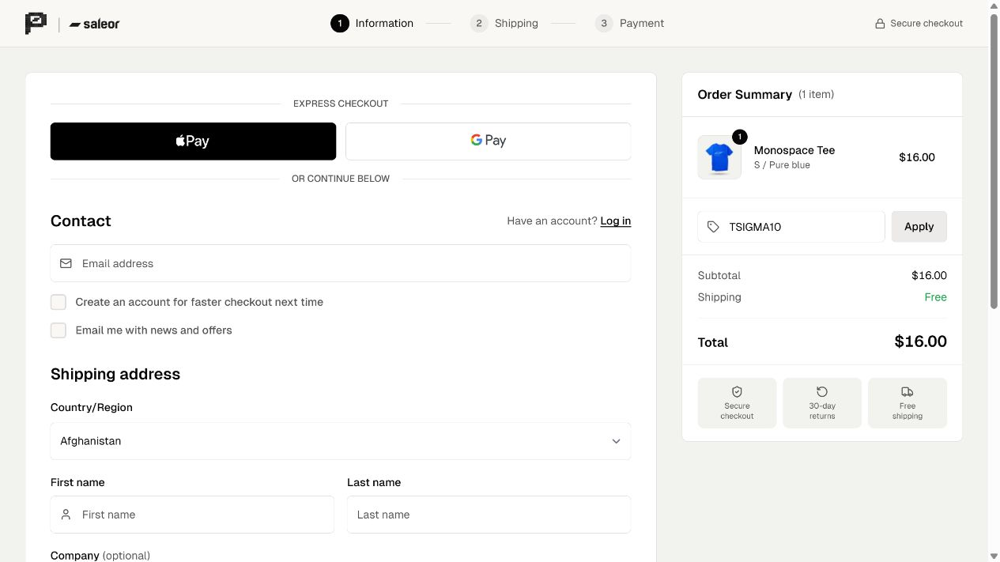
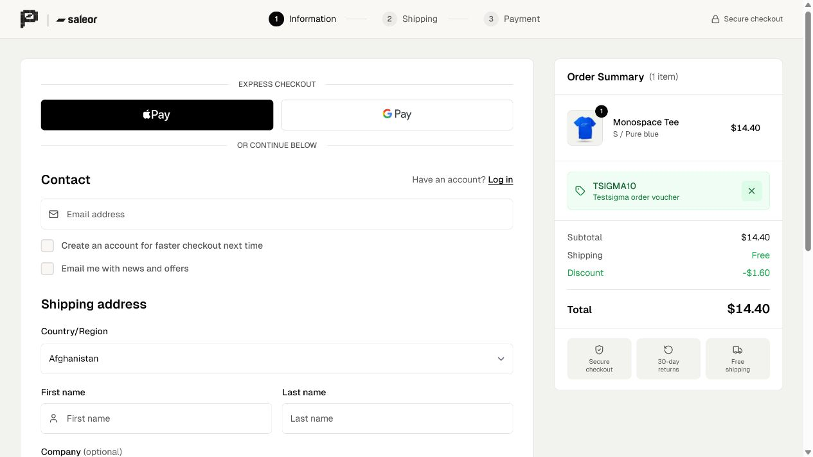

# Manual environment validation

Observed on 2026-10-02. These are operator-run setup checks, not results from an implemented agent or graph-based coverage analysis.

## Builds and source provenance

| Variant | Original source | Deployment source | Vercel deployment |
|---|---|---|---|
| Baseline | `23bc49ccd22e13e182b30daff562d5e5c9af874c` | `6e55bd8b924c0341e21a85d4666ca510838ed4e5` | `dpl_8wQZMtEq7uJjHeCGJR2uDN8qhbvh` |
| Patched | `221be2247f5b1a8ef94f007639fe83f53a6384b8` | `9fb3467650807d4ee0ee8548ffb75cb4ea728eae` | `dpl_E2ZkGfToXhbP7MPaz5n6He4jCd8v` |

Both builds ran frozen-lockfile dependency installation, storefront and checkout GraphQL generation against the sandbox, compilation, TypeScript checks, and prerendering successfully. Both production aliases returned HTTP 200 without authentication from an independent HTTP client.

The first attempt failed because Vercel discontinued Node 20. The next attempt compiled but failed with `USE_CACHE_TIMEOUT` in navigation on an account page. Identical deployment adjustments resolved these issues: Node 22 and exclusion of session-dependent requests from the public prerender queue. The original analysis commits remain untouched, and `git diff` between final deployment branches contains only the original two PR files.

## Core browser checks

Used separate checkouts on the two domains with one Monospace Tee, size S, Pure blue, USD 16.00. Product listing, detail page, variant selection, add-to-bag, and guest checkout were verified on both.

| Check | Baseline | Patched |
|---|---|---|
| Apply real `TSIGMA10` voucher | No applied state; USD 16.00 remains | Voucher shown; USD 14.40 |
| Independent backend read after UI action | No voucher; discount 0; total 16 | `TSIGMA10`; discount 1.60; total 14.40 |
| Remove voucher | Not applicable to unapplied voucher | Original USD 16.00 restored |
| Invalid code | Not tested in browser | Visible `Promo code is invalid`; total stays 16 |
| Shipping voucher before address/method | Not tested in browser | Visible `Voucher is not applicable to this checkout.` |
| Shipping voucher after address/method | Not tested in browser | Voucher accepted; shipping becomes zero |

API evidence: [baseline](../artifacts/baseline-voucher-api.json), [patched](../artifacts/patched-voucher-api.json). Checkout identifiers are deliberately omitted from these published evidence files.

[Invalid-code UI screenshot](../artifacts/screenshots/patched-invalid-voucher.jpg).

For shipping validation, the patched checkout used fictional test data: `testsigma-smoke@example.com`, Testsigma Sandbox, 1 Test Street, Warsaw 00-001, Poland. Selecting UPS and continuing to the payment step saved the method. Saleor applied destination VAT, giving a product total of USD 19.68 and gross shipping of USD 33.44 (total USD 53.12). Applying `TSIGMASHIP` reduced gross shipping to zero and total to USD 19.68, confirmed in both UI and API. No payment information was entered and no order was submitted.

Evidence: [before shipping voucher](../artifacts/patched-before-shipping-voucher-api.json), [after shipping voucher](../artifacts/patched-shipping-voucher-api.json), [UI screenshot](../artifacts/screenshots/patched-shipping-voucher.jpg). The earlier USD 16 / USD 14.40 comparison was before destination-specific tax; do not compare those figures across different address states.

## Backend fixtures

The [direct backend smoke check](../artifacts/backend-fixtures.json) verified voucher application, USD 1.60 discount, removal, invalid-code rejection, and rejection of the shipping voucher before shipping prerequisites exist. This uses a separate temporary checkout and must not be confused with evidence of frontend behavior.

Both vouchers are active on Channel-USD with no use cap, minimum purchase, or end date. Shipping voucher setup is captured [here](../artifacts/screenshots/shipping-voucher.jpg). A minimum-spend fixture has not been created.

## Scope limits

No real payments or completed orders. No customer account or credential is needed for these guest-checkout checks. The sandbox and public documentation can change; record their state again during future runs. The autonomous crawler, graph, impact analyzer, full evaluation suite, design document, and demo remain future assignment work.
