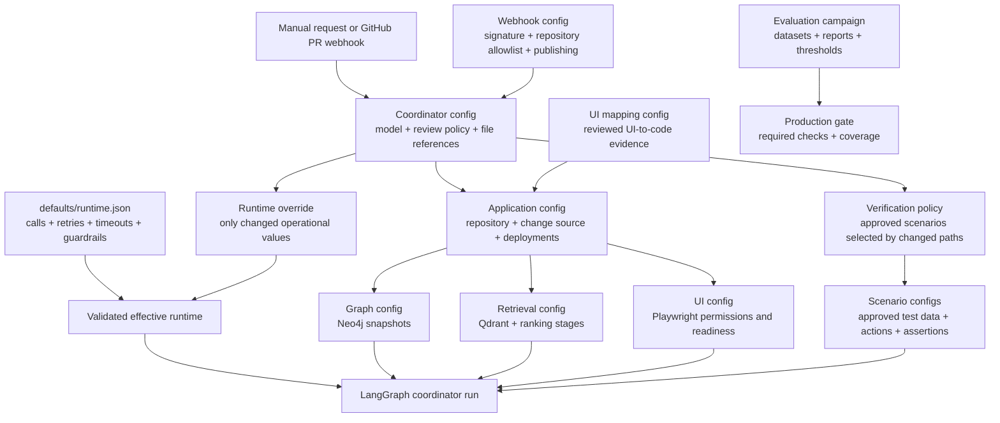

# Configuration map

This is the complete configuration flow. Start with one coordinator file; follow only the arrows
needed for that run.



## Files and their purpose

| Config | What it describes | Change it when |
| --- | --- | --- |
| [`saleor-verified.json`](saleor-verified.json) | Main coordinator run: application, model, response formatter, review, runtime override and verification references | You select the model or enable verification |
| [`saleor-live.json`](saleor-live.json) | Main run with bounded UI discovery | You want the agent to inspect the deployed UI before analysis |
| [`saleor-webhook.json`](saleor-webhook.json) | Main run used by the GitHub webhook worker | A PR event should start analysis automatically |
| [`application/`](application/) | Repository, PR/change source and baseline/patched deployments | You connect another repository or deployment |
| [`graph/`](graph/) | Baseline and patched Neo4j graph snapshots | You generate a new code graph |
| [`retrieval/`](retrieval/) | Ingestion run, vector store and optional reranker/selector | You switch knowledge data or retrieval strategy |
| [`ui/`](ui/) | UI provider, start path, readiness checks and allowed controls | You use another browser adapter or UI |
| [`defaults/runtime.json`](defaults/runtime.json) | Default calls, retries, timeouts and guardrails | The product-wide safe defaults change |
| [`runtime/`](runtime/) | Small deployment-specific overrides | One run needs different limits, DLP or observability |
| [`verification/saleor-policy.json`](verification/saleor-policy.json) | Approved scenario catalog and changed-path selection | You add or select a behavior scenario |
| [`verification/`](verification/) | Approved test data, browser steps and deterministic assertions | Product behavior or test data changes |
| [`webhook/saleor.json`](webhook/saleor.json) | Webhook security, allowed events, queue and PR-comment publishing | GitHub integration settings change |
| [`mapping/saleor.json`](mapping/saleor.json) | Reviewed UI evidence mapped to code components | You publish new UI-to-code graph evidence |
| [`evaluation/final-campaign.json`](evaluation/final-campaign.json) | Evaluation inputs and quality thresholds | Datasets, reports or acceptance thresholds change |
| [`release/production-gate.json`](release/production-gate.json) | Final required behavior, tests and coverage | Release acceptance criteria change |
| [`security/google-dlp.example.json`](security/google-dlp.example.json) | Example external Google DLP policy | Organization-level artifact scanning is enabled |
| [`../tests/fixtures/`](../tests/fixtures/README.md) | Synthetic offline tools, model decisions, requests and demo configs | Tests or the credential-free demo are executed |

## How runtime settings are resolved

```text
defaults/runtime.json
        +
optional runtime/<name>.json overrides
        ↓
validated RuntimeConfig used by the coordinator
```

For example, [`runtime/standard.json`](runtime/standard.json) changes only four values. Every omitted
value comes from `defaults/runtime.json`. Unknown properties and invalid values are rejected by the
JSON schemas before the run starts.

## Simple presentation order

1. The coordinator file selects the application, model and optional policies.
2. The application file identifies the repository and two deployed versions.
3. The application selects one graph, retrieval and UI provider configuration.
4. Runtime defaults always apply; a runtime file overrides only named values.
5. Verification policy selects pre-approved scenarios from changed file paths.
6. The webhook file can create the same coordinator request automatically for a PR.
7. Evaluation and release configs measure the saved result; they do not control agent reasoning.

## Response formatting

Production profiles enable one optional writing call with a single setting:

```json
"response_formatter": {
  "provider": "llm"
}
```

The LLM formatter reuses the configured coordinator model. It may improve only the executive summary
and finding explanations. Status, evidence IDs, review questions, executed checks, gaps and call
usage remain deterministic. If the LLM formatter fails, the fallback formatter invokes the template.
